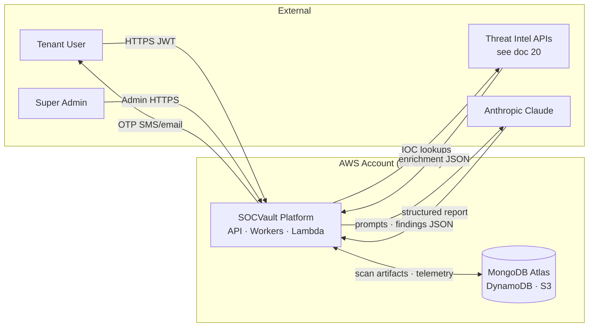
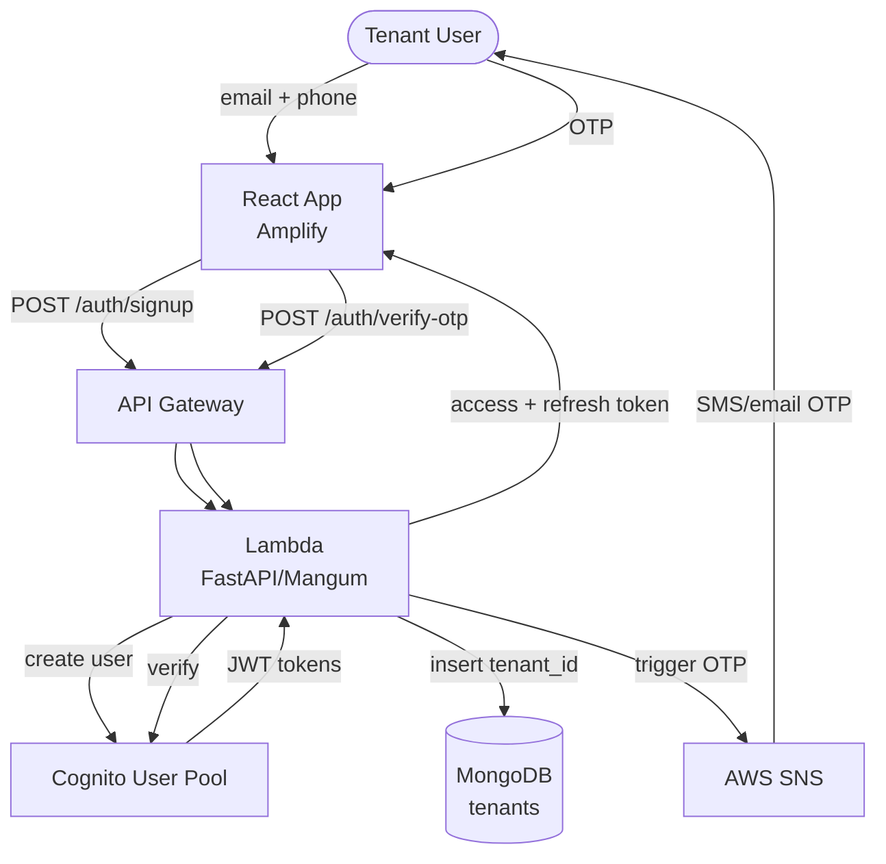
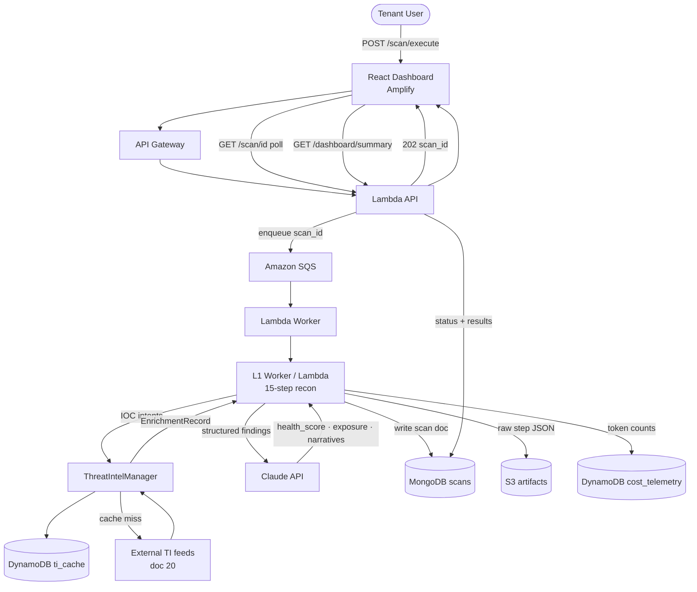
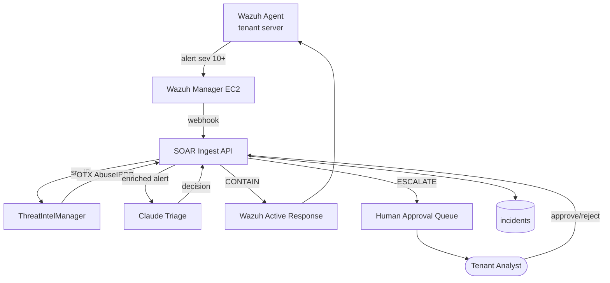
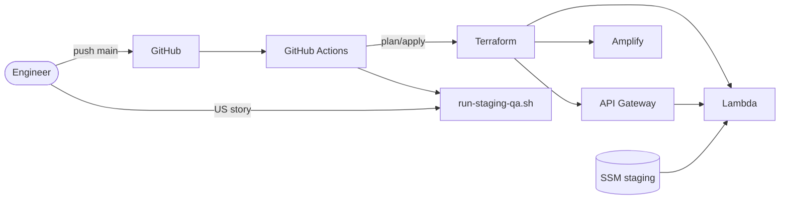

# SOCVault — Data Flow Diagrams (DFD)
**Version 1.1 | June 2026**

---

## 1. Purpose

Visual data-flow reference for engineers, security review, and ISO 27001 preparation. **Behavioural detail** lives in [`21_MVP_FUNCTIONAL_SPEC.md`](./21_MVP_FUNCTIONAL_SPEC.md); **feed catalogue** in [`20_FREE_EXTERNAL_APIS.md`](./20_FREE_EXTERNAL_APIS.md); **API contracts** in [`api/openapi.yaml`](../api/openapi.yaml).

> **Full diagram suite:** C4, system flows, RBAC, module connectivity, scan layers, ops, trust boundaries, API map, and state machines live in [`diagrams/00_INDEX.md`](./diagrams/00_INDEX.md). Extended DFDs (billing, AI chat, isolation, L2/L9) are in [`diagrams/03_DATA_FLOW_EXTENDED.md`](./diagrams/03_DATA_FLOW_EXTENDED.md).

**Notation:**

| Symbol | Meaning |
|---|---|
| Rectangle | External entity (user, third party) |
| Rounded box | Process (SOCVault component) |
| Cylinder | Data store |
| Arrow | Data flow (label = payload) |

---

## 2. Context diagram (DFD Level 0)

Shows SOCVault as a single process between users, AWS, AI, and threat-intel providers.



**Trust boundary:** Everything inside the AWS subgraph is SOCVault-controlled. Tenant data never crosses to another tenant's partition (`tenant_id` on all documents).

---

## 3. Level 1 — Authentication & tenant provisioning

**Scope:** Signup through first JWT. **Spec:** [`21_MVP_FUNCTIONAL_SPEC.md`](./21_MVP_FUNCTIONAL_SPEC.md) §3.



| Flow | Data | Store |
|---|---|---|
| Signup | `{ email, phone }` → `{ tenant_id }` | `tenants` |
| Verify | `{ otp }` → `{ access_token, refresh_token }` | Cognito session |
| Me | JWT → `{ tenant profile, tier }` | Read `tenants` |

---

## 4. Level 1 — L1 scan pipeline (MVP core)

**Scope:** Freemium recon scan end-to-end. **Spec:** §4–§5 in functional spec.



### 4.1 Data stores touched (single scan)

| Store | Key | Written |
|---|---|---|
| MongoDB `scans` | `tenant_id`, `scan_id` | Full scan record + AI output |
| S3 | `{tenant_id}/{scan_id}/` | Raw tool output, logs |
| DynamoDB `cost_telemetry` | per scan | Claude tokens, Lambda duration |
| DynamoDB `ti_cache` | `IP#`, `DOMAIN#`, etc. | Enrichment payloads (TTL) |
| MongoDB `enrichment_records` | optional Phase 2.11 | Normalised IOC history |

### 4.2 Failure paths

| Failure | Behaviour |
|---|---|
| TI feed down | Scan completes; `enrichment_status: partial` |
| Claude down | Offline template report (FR-047) |
| Rate limit (freemium) | `429` before enqueue |
| Worker crash | Scan `status: failed`; error in MongoDB |

---

## 5. Level 1 — Threat intelligence & correlation

**Scope:** Admin config + runtime enrichment. **Catalogue:** doc 20 only.

```mermaid
flowchart TB
  SA([Super Admin])
  UI[API Explorer\nTI Feeds tab]
  VAULT[Pass and Keys\nKMS encrypted]
  TAPI[/admin/ti/feeds/*]
  TIM[ThreatIntelManager]
  RL[Rate Limiter]
  CACHE[(ti_cache · ti_usage)]
  CORR[CorrelationEngine]
  SQS[SQS ti-correlation]
  CLU[(correlation_clusters)]
  SCAN[L1/L7/L8 Workers]

  SA -->|configure keys| UI
  UI --> VAULT
  SA -->|enable/test feeds| UI
  UI --> TAPI
  TAPI --> TIM
  SCAN -->|enrich_ip lookup_cve etc| TIM
  TIM --> RL
  RL --> CACHE
  TIM -->|provider adapters| EXT[32 TI providers\ndoc 20 §5]
  EXT --> TIM
  TIM -->|EnrichmentRecord| SCAN
  TIM -->|async event| SQS
  SQS --> CORR
  CORR --> CLU
  CORR -->|enrichment_summary| CL[Claude report]
```

**Admin vs runtime separation:**

- **Admin path:** configure keys, quotas, priority — no scan data.
- **Runtime path:** read-only feed config snapshot; writes cache + enrichment records only.

---

## 6. Level 1 — SOAR alert pipeline (Phase 2)

**Scope:** Post-MVP beta; included for architectural continuity. **FRs:** FR-060–069.



---

## 7. Level 1 — CI/CD & environments

**Scope:** How code and config reach staging vs production. **Detail:** [`19_CI_CD_AND_ENVIRONMENTS.md`](./19_CI_CD_AND_ENVIRONMENTS.md).



**Data isolation rule:** Staging and production **never share** Cognito pools, S3 buckets, MongoDB databases, or SSM prefixes.

---

## 8. Level 1 — Super Admin API Explorer (Milestone 2.9)

```mermaid
flowchart TB
  SA([Super Admin])
  UI[API Explorer UI]
  CAT[/admin/explorer/catalog]
  TEST[/admin/explorer/test]
  VAULT[/admin/vault/*]
  KMS[AWS KMS]
  API[Internal API proxy]
  AUD[(audit_log)]

  SA --> UI
  UI --> CAT
  UI -->|send test| TEST
  TEST -->|resolve vars| VAULT
  VAULT --> KMS
  TEST -->|proxy request| API
  API -->|response| TEST
  TEST -->|auto-save tokens| VAULT
  VAULT -->|reveal/copy| AUD
```

---

## 9. Data dictionary (summary)

Full schemas: [`02_TECHNICAL_STACK.md`](./02_TECHNICAL_STACK.md) §3.

| Entity | Primary store | Partition key | PII |
|---|---|---|---|
| Tenant | MongoDB | `tenant_id` | email, phone |
| Scan | MongoDB | `tenant_id` + `scan_id` | domain, findings |
| Enrichment | MongoDB / DynamoDB | `tenant_id` / IOC key | IOC values |
| Vault secret | DynamoDB + KMS | env + key name | API keys |
| COGS | DynamoDB | date + tenant | No |
| Incident | MongoDB | `tenant_id` | IPs, alert context |

---

## 10. Diagram maintenance

| When | Update |
|---|---|
| New external API provider | Doc 20 only — DFD unchanged unless new entity type |
| New MVP API route | §11 in functional spec + openapi; add to Level 1 if new process |
| Infra change (e.g. production cutover, EKS) | §7 + ADR-004 + ADR-006 |
| SOAR go-live | Validate §6 against implementation |

---

## 11. Related documents

| Doc | Role |
|---|---|
| [`diagrams/00_INDEX.md`](./diagrams/00_INDEX.md) | Master index — all diagram types |
| [`diagrams/02_SYSTEM_FLOWS.md`](./diagrams/02_SYSTEM_FLOWS.md) | Sequence diagrams (journeys) |
| [`diagrams/04_RBAC_MAPPING.md`](./diagrams/04_RBAC_MAPPING.md) | RBAC control matrices |
| [`diagrams/05_MODULE_CONNECTIVITY.md`](./diagrams/05_MODULE_CONNECTIVITY.md) | Module dependency graph |
| [`21_MVP_FUNCTIONAL_SPEC.md`](./21_MVP_FUNCTIONAL_SPEC.md) | Inputs, outputs, rules per process |
| [`14_THREAT_MODEL.md`](./14_THREAT_MODEL.md) | STRIDE on flows above |
| [`20_FREE_EXTERNAL_APIS.md`](./20_FREE_EXTERNAL_APIS.md) | External entity catalogue |

---

*Render Mermaid diagrams in GitHub, Cursor, or [mermaid.live](https://mermaid.live) for presentations.*
