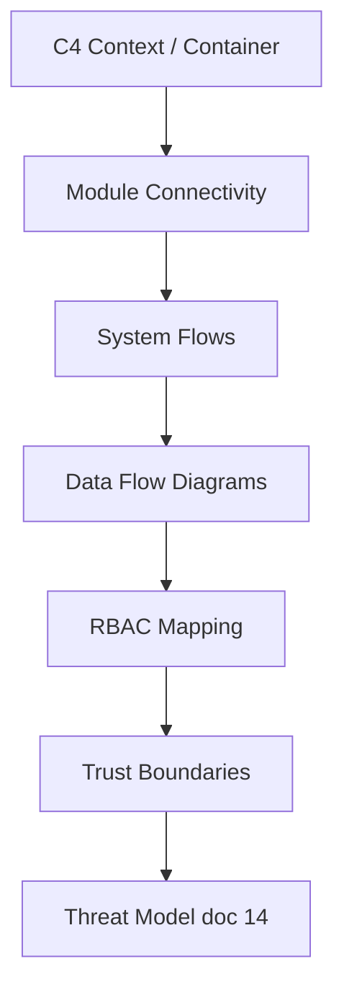

# SOCVault — Architecture Diagram Index
**Version 1.0 | June 2026**

Master index for all visual architecture artefacts. Diagrams use **Mermaid** (render in GitHub, Cursor, or [mermaid.live](https://mermaid.live)).

---

## Diagram catalogue

| # | Document | Type | Audience |
|---|---|---|---|
| 01 | [C4 Context & Container](./01_C4_CONTEXT_CONTAINER.md) | C4 | Everyone — holistic system view |
| 02 | [System Flows](./02_SYSTEM_FLOWS.md) | Sequence / swimlane | Engineers — journeys over time |
| 03 | [Data Flow (extended)](./03_DATA_FLOW_EXTENDED.md) | DFD L1/L2 | Security, ISO 27001, backend |
| — | [Data Flow (core)](../22_DATA_FLOW_DIAGRAMS.md) | DFD L0/L1 | Auth, L1 scan, TI, SOAR, CI/CD |
| 04 | [RBAC Control Mapping](./04_RBAC_MAPPING.md) | Matrix + auth flow | Auth, admin, compliance |
| 05 | [Module Connectivity](./05_MODULE_CONNECTIVITY.md) | Component graph | Epic planning, integration |
| 06 | [Scan Layers L1–L9](./06_SCAN_LAYERS.md) | Reference | Per-layer tools, tiers, limits |
| 07 | [Ops, CI/CD & Observability](./07_OPS_AND_CICD.md) | Infra flow | DevOps, cutover, monitoring |
| 08 | [Trust Boundaries & Security](./08_TRUST_AND_SECURITY.md) | Boundary map | Threat model companion |
| 09 | [API Surface Map](./09_API_SURFACE.md) | Route grouping | API-first build order |
| 10 | [State Machines](./10_STATE_MACHINES.md) | State charts | Scan, incident, subscription |

---

## How diagram types relate

| Question | Read |
|---|---|
| What deployable pieces exist? | 01 C4 Container |
| How do product modules depend on each other? | 05 Module Connectivity |
| What happens step-by-step for onboarding / scan / billing? | 02 System Flows |
| What data moves where? | 22 + 03 Data Flow |
| Who can trigger each action? | 04 RBAC |
| What can go wrong at each boundary? | 08 Trust + doc 14 |

---

## Traceability

| Diagram set | Linked artefacts |
|---|---|
| All | [`03_REQUIREMENTS.md`](../03_REQUIREMENTS.md) · [`16_TRACEABILITY_MATRIX.md`](../16_TRACEABILITY_MATRIX.md) |
| Flows | [`21_MVP_FUNCTIONAL_SPEC.md`](../21_MVP_FUNCTIONAL_SPEC.md) · wireframes `01–25` |
| API | [`06_API_SPECIFICATION.md`](../06_API_SPECIFICATION.md) · [`api/openapi.yaml`](../../api/openapi.yaml) |
| Infra | ADR-006 · [`19_CI_CD_AND_ENVIRONMENTS.md`](../19_CI_CD_AND_ENVIRONMENTS.md) |
| External APIs | [`20_FREE_EXTERNAL_APIS.md`](../20_FREE_EXTERNAL_APIS.md) |

---

## Maintenance

| When | Update |
|---|---|
| New epic or module | 05 Module Connectivity + 00 index |
| New API route group | 09 API Surface + relevant sequence in 02 |
| RBAC change | 04 only — never merge tenant/internal/SSO models |
| Infra change (ADR) | 01, 07, 08, doc 22 §7 |
| New scan layer behaviour | 06 Scan Layers + DFD in 22 or 03 |

---

*Generated as part of blueprint v1.17 diagram suite.*
