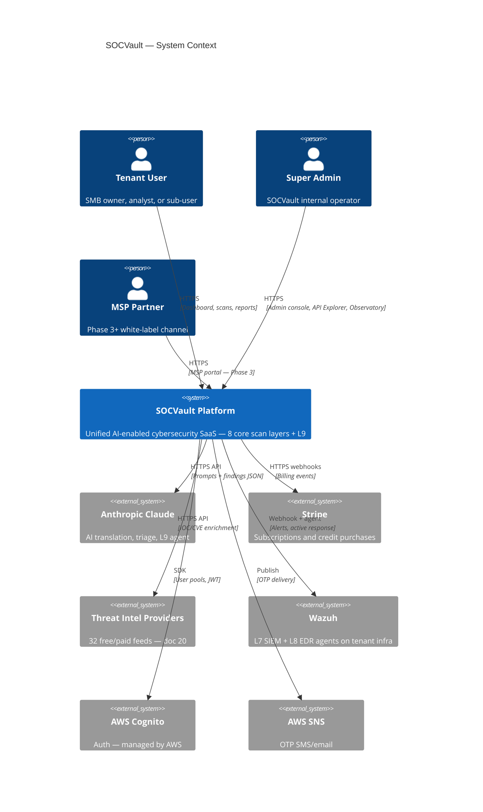
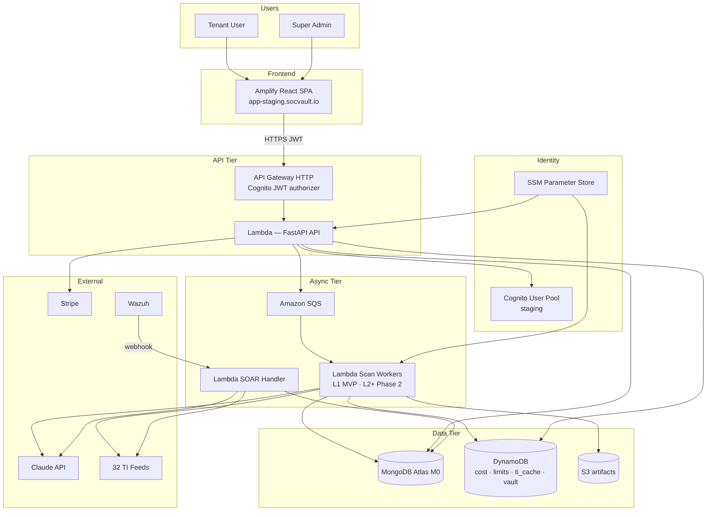
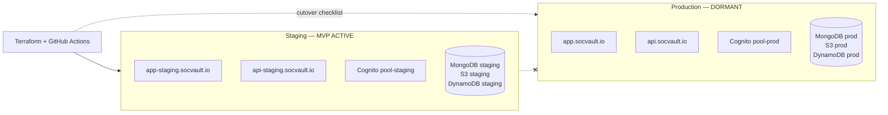

# SOCVault — C4 Context & Container Diagrams
**Version 1.0 | June 2026**

C4 Level 1 (Context) and Level 2 (Container) for the **staging-first serverless MVP** (ADR-006). Production is structurally identical but **dormant** until cutover.

**Related:** [`02_TECHNICAL_STACK.md`](../02_TECHNICAL_STACK.md) · [`adr/006-serverless-mvp-staging-first-iac.md`](../adr/006-serverless-mvp-staging-first-iac.md)

---

## 1. System Context (C4 Level 1)

Shows SOCVault as one software system and its users/external dependencies.



### Context summary

| Actor | Relationship |
|---|---|
| Tenant User | Primary customer — onboarding, scans, dashboard, SOAR approval |
| Super Admin | Internal — TI registry, vault, dev tracker, COGS, cross-tenant ops |
| MSP Partner | Resells/manages tenant workspaces (Phase 3) |
| Claude | Core differentiator — every layer passes through AI intelligence |
| Threat Intel | Enrichment at scan time and SOAR triage |
| Stripe | Paid tiers, AI credits, per-target licensing |
| Wazuh | L7/L8 runtime on tenant servers (SOC Pro tier) |

---

## 2. Container Diagram (C4 Level 2) — Staging MVP

Deployable units inside AWS account `eu-west-2`. Staging URLs: `app-staging.socvault.io`, `api-staging.socvault.io`.

```mermaid
C4Container
  title SOCVault — Container Diagram (Staging MVP)

  Person(user, "Tenant / Admin", "Browser")

  Container_Boundary(aws, "AWS Account (eu-west-2)") {
    Container(web, "React SPA", "Amplify", "Tenant + admin UI")
    Container(apigw, "API Gateway", "HTTP API", "JWT authorizer, routing")
    Container(api, "API Lambda", "FastAPI/Mangum", "REST handlers, tier gates")
    Container(worker, "Scan Workers", "Lambda + SQS", "L1–L9 job execution")
    Container(soar, "SOAR Handler", "Lambda", "Incident ingest + playbooks")
    ContainerDb(mongo, "MongoDB Atlas M0", "Document DB", "tenants, scans, incidents")
    ContainerDb(dynamo, "DynamoDB", "Key-value", "COGS, rate limits, TI cache, vault sessions")
    ContainerDb(s3, "S3", "Object store", "Scan artifacts per tenant_id")
    Container(cognito, "Cognito User Pool", "Auth", "One pool per environment")
    Container(ssm, "SSM Parameter Store", "Secrets", "API keys — MVP")
    Container(sqs, "Amazon SQS", "Queue", "Scan + TI correlation jobs")
    Container(obs, "Metrics Observatory", "React admin module", "COGS, health — Phase 2.8")
  }

  System_Ext(claude, "Claude API")
  System_Ext(ti, "Threat Intel APIs")
  System_Ext(stripe, "Stripe")

  Rel(user, web, "HTTPS")
  Rel(web, apigw, "JSON/HTTPS", "Bearer JWT")
  Rel(apigw, api, "Invoke")
  Rel(api, sqs, "Enqueue")
  Rel(sqs, worker, "Trigger")
  Rel(worker, mongo, "Read/Write")
  Rel(worker, s3, "Write artifacts")
  Rel(worker, dynamo, "Telemetry, cache")
  Rel(worker, claude, "Findings → report")
  Rel(worker, ti, "Enrichment")
  Rel(api, mongo, "CRUD")
  Rel(api, dynamo, "Rate limits")
  Rel(api, cognito, "Validate JWT")
  Rel(api, stripe, "Checkout webhooks")
  Rel(soar, mongo, "Incidents")
  Rel(ssm, api, "Secrets")
  Rel(ssm, worker, "Secrets")
  Rel(admin, obs, "Internal RBAC")
```

---

## 3. Container diagram (Mermaid flowchart alternative)

For renderers without C4 support:



---

## 4. Environment split (staging vs production)



**Rule (ADR-006):** No shared Cognito pools, databases, buckets, or SSM prefixes between environments.

---

## 5. Paid-tier evolution (future containers)

Not in MVP staging; documented for Series A / scale path:

| Container | When | Purpose |
|---|---|---|
| Amazon EKS | Paid tier | L2+ scan workers at scale, Wazuh manager |
| CloudFront + AWS WAF | Paid tier | CDN, DDoS, edge caching |
| AWS Secrets Manager | Paid tier | Replaces SSM for rotation |
| ElastiCache Redis | Optional | Rate limit hot path |
| Grafana + CloudWatch | Milestone 4.4 | SRE dashboards |

---

## Related documents

| Doc | Role |
|---|---|
| [`07_OPS_AND_CICD.md`](./07_OPS_AND_CICD.md) | Deploy and cutover flows |
| [`05_MODULE_CONNECTIVITY.md`](./05_MODULE_CONNECTIVITY.md) | Logical modules inside containers |
| [`22_DATA_FLOW_DIAGRAMS.md`](../22_DATA_FLOW_DIAGRAMS.md) | Data movement detail |
