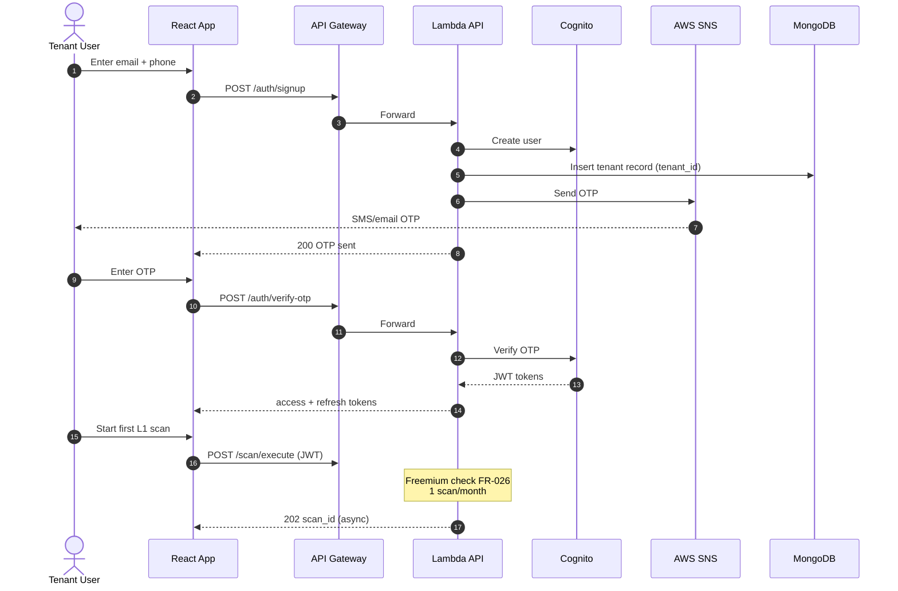
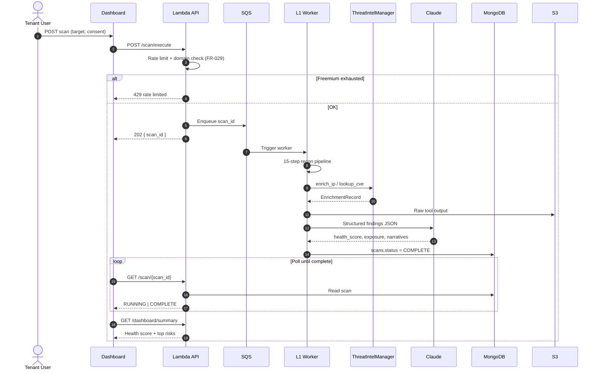
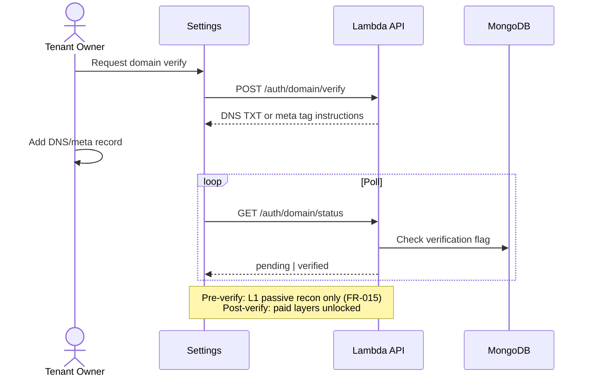
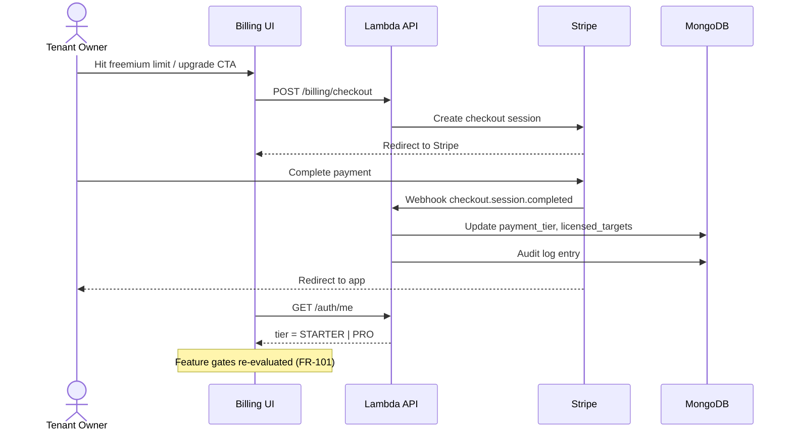
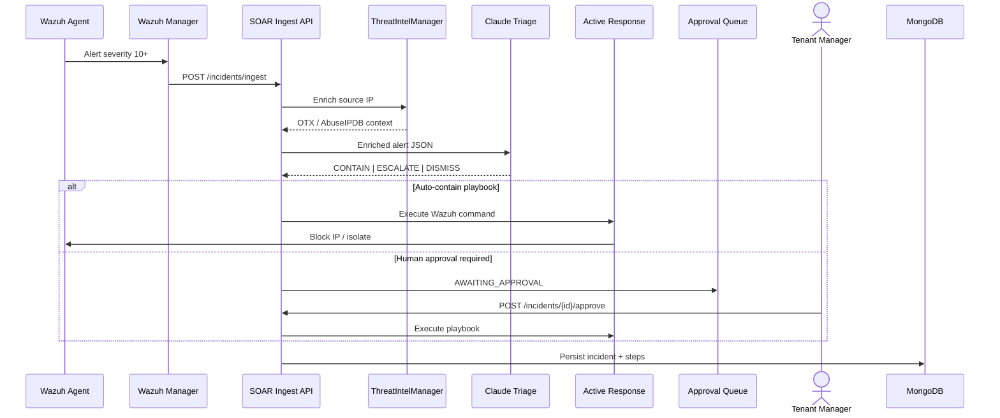
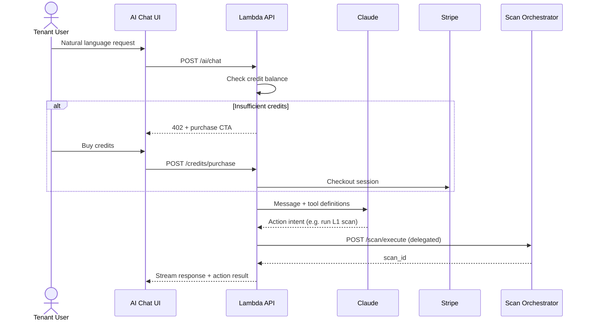
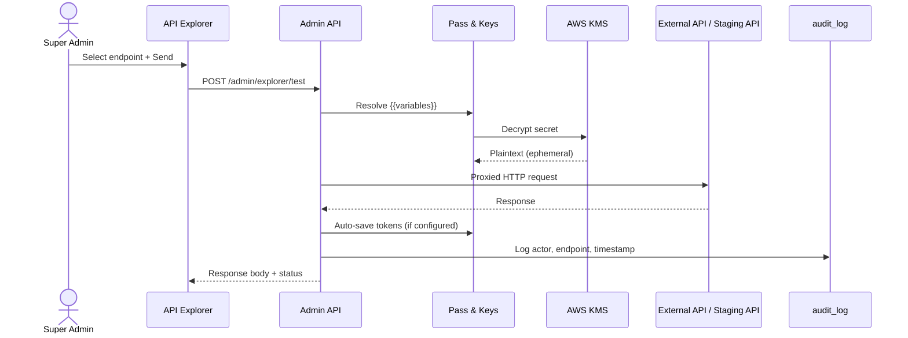
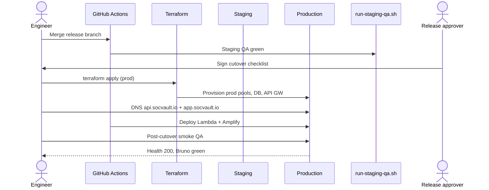
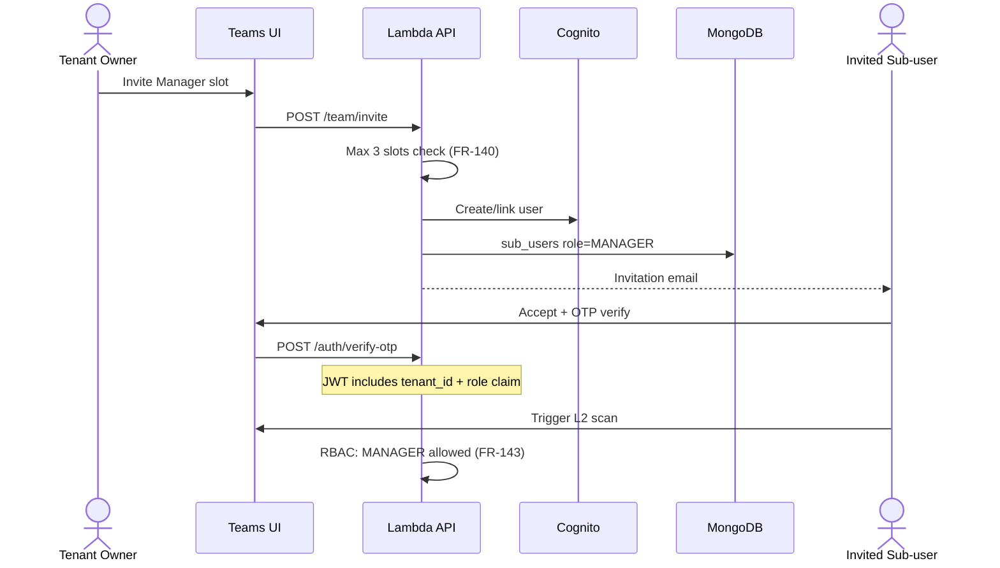
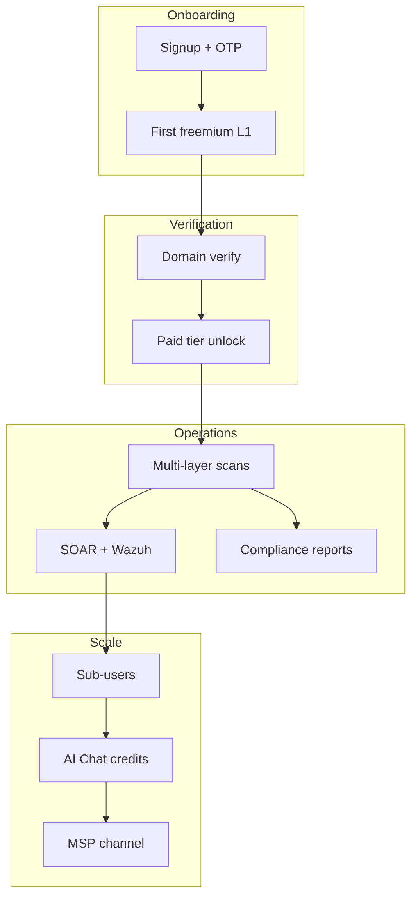

# SOCVault — System Flow Diagrams
**Version 1.0 | June 2026**

Sequence and swimlane diagrams for **key product journeys**. Complements DFDs in [`22_DATA_FLOW_DIAGRAMS.md`](../22_DATA_FLOW_DIAGRAMS.md) and [`03_DATA_FLOW_EXTENDED.md`](./03_DATA_FLOW_EXTENDED.md).

**Spec:** [`21_MVP_FUNCTIONAL_SPEC.md`](../21_MVP_FUNCTIONAL_SPEC.md)

---

## 1. Onboarding — signup to first scan (MVP)

**Wireframe:** `01-onboarding.html` · **US:** US-001–007 · **FR:** FR-001–006, FR-026

---

## 2. L1 scan — execute to dashboard (MVP core)

**Wireframes:** `03-l1-recon.html`, `04-l1-report.html` · **US:** US-008–020

---

## 3. Domain verification gate (Phase 2)

**FR:** FR-010–014 · Blocks paid/active scans until verified.

---

## 4. Upgrade path — freemium to paid (Phase 2)

**Wireframe:** `14-billing.html` · **FR:** FR-101, FR-072–076

---

## 5. SOAR alert pipeline (Phase 2 beta)

**Wireframe:** `13-soar.html` · **FR:** FR-060–069 · **DFD:** doc 22 §6

---

## 6. AI Chat — credit purchase to scan action (Phase 3)

**Wireframe:** `12-ai-chat.html` · **FR:** FR-121–129

---

## 7. Super Admin — API Explorer test call (Milestone 2.9)

**Wireframe:** `24-admin-api-explorer.html` · **FR:** FR-183–193

---

## 8. Production cutover (ADR-006)

**Doc:** [`23_MVP_BUILD_ORDER_AND_QA.md`](../23_MVP_BUILD_ORDER_AND_QA.md) §7

---

## 9. Tenant sub-user invite (Phase 2)

**Wireframe:** `21-tenant-teams.html` · **FR:** FR-140–144

---

## 10. Swimlane — end-to-end tenant lifecycle

---

## Related documents

| Doc | Role |
|---|---|
| [`04_RBAC_MAPPING.md`](./04_RBAC_MAPPING.md) | Who can run each step |
| [`10_STATE_MACHINES.md`](./10_STATE_MACHINES.md) | Scan/incident/subscription states |
| [`05_MODULE_CONNECTIVITY.md`](./05_MODULE_CONNECTIVITY.md) | Module dependencies |
