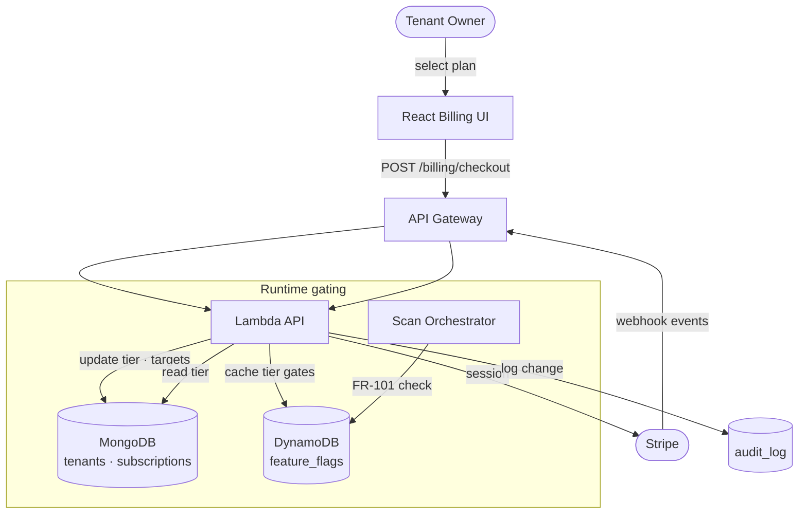
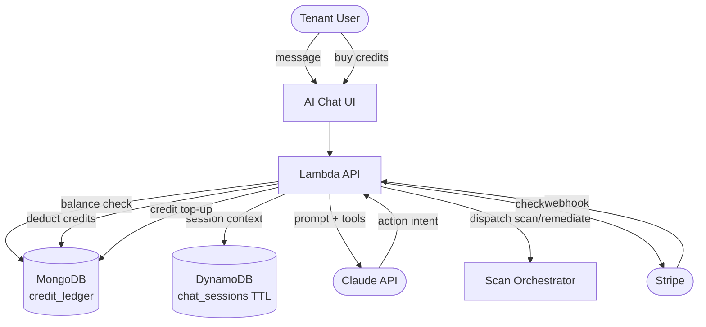
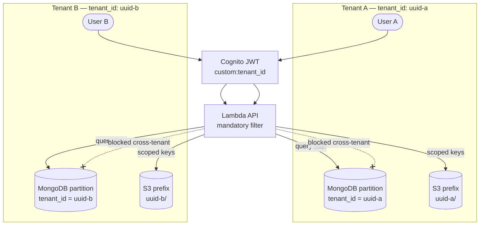
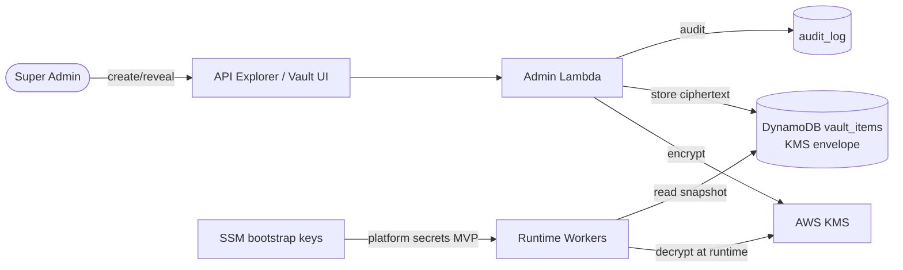
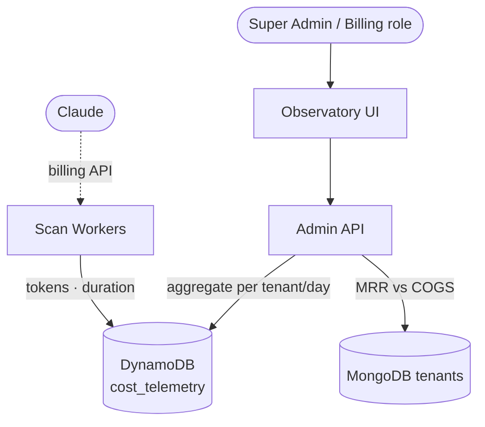
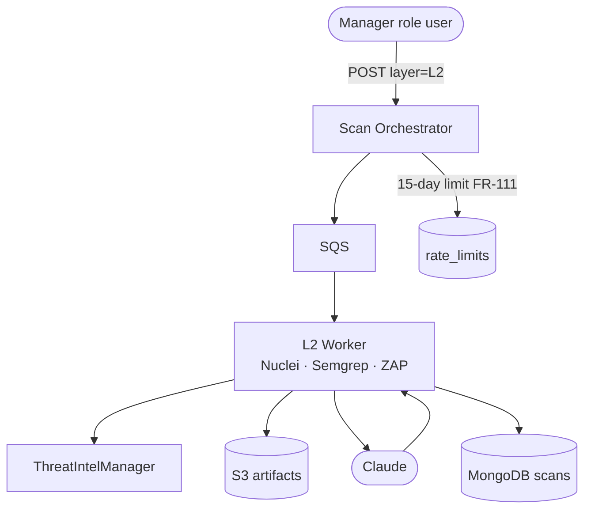
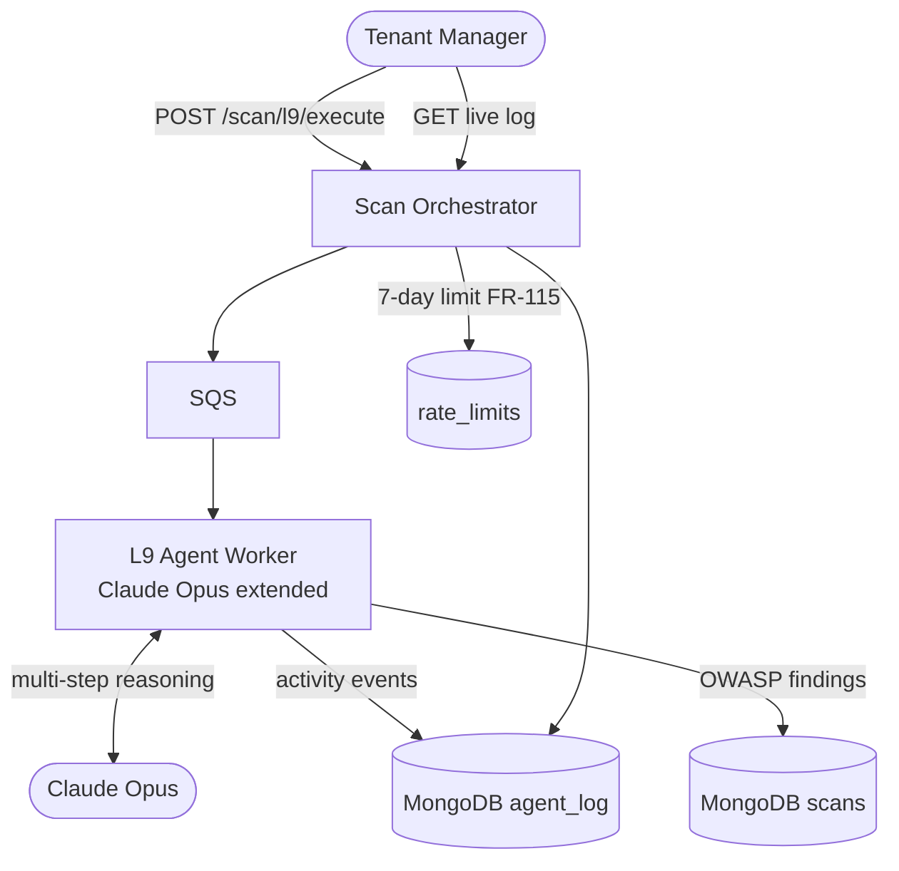
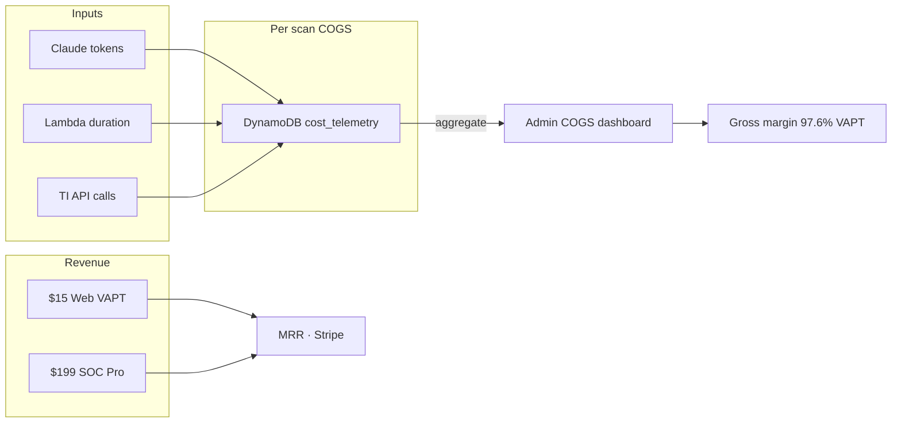
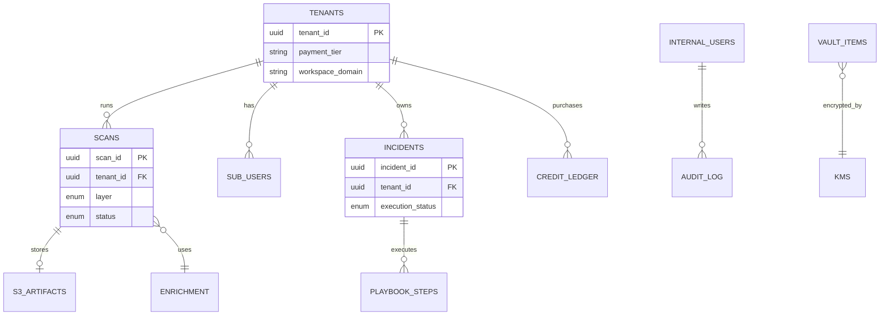
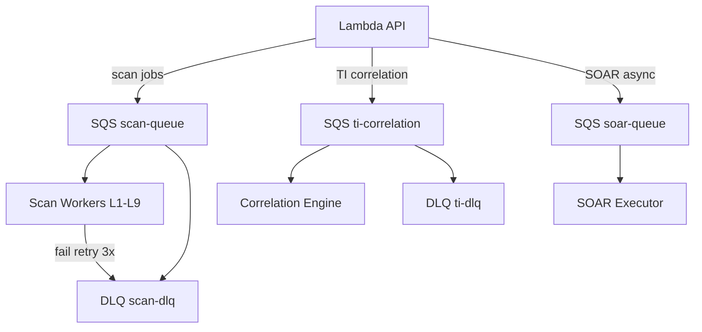

# SOCVault — Data Flow Diagrams (Extended)
**Version 1.0 | June 2026**

Additional DFD Level 1 and Level 2 flows not in [`22_DATA_FLOW_DIAGRAMS.md`](../22_DATA_FLOW_DIAGRAMS.md). Core flows (auth, L1, TI, SOAR, CI/CD, API Explorer) remain in doc 22.

**Notation:** Rectangle = external entity · Rounded = process · Cylinder = data store

---

## 1. Billing & tier gating (Phase 2)

**FR:** FR-101, FR-072–076 · **Wireframe:** `14-billing.html`

| Data | Store | PII |
|---|---|---|
| `stripe_customer_id`, `payment_tier` | MongoDB `tenants` | No |
| Webhook payload | Transient | Email in Stripe object |
| Tier gate snapshot | DynamoDB | No |

---

## 2. AI Chat & credits (Phase 3)

**FR:** FR-121–129 · **Wireframe:** `12-ai-chat.html`

---

## 3. Multi-tenant isolation boundary

**FR:** FR-005, NFR-025 · **ADR:** ADR-006

**Rules:**
1. Every MongoDB query includes `tenant_id` from JWT — never from request body alone.
2. S3 keys prefixed `{tenant_id}/{scan_id}/`.
3. Super Admin cross-tenant reads require internal RBAC (FR-155+) + audit (FR-165).

---

## 4. Pass & Keys vault data flow

**FR:** FR-183–193 · **Wireframe:** `24-admin-api-explorer.html`

---

## 5. Metrics Observatory & COGS telemetry

**FR:** FR-105, FR-170–182 · **Wireframe:** `23-admin-observatory.html`

---

## 6. L2 Web AppSec scan (Level 2 DFD)

**Wireframe:** `05-l2-web.html` · **FR:** FR-032–035, FR-111

---

## 7. L9 AI Agent Scan (Phase 2)

**Wireframe:** `20-l9-ai-scan.html` · **FR:** FR-130–135

---

## 8. Cost flow diagram

---

## 9. Logical entity relationship (data stores)

Full schemas: [`02_TECHNICAL_STACK.md`](../02_TECHNICAL_STACK.md) §3.

---

## 10. Event-driven architecture (SQS)

---

## Related documents

| Doc | Role |
|---|---|
| [`22_DATA_FLOW_DIAGRAMS.md`](../22_DATA_FLOW_DIAGRAMS.md) | Core DFD L0/L1 |
| [`14_THREAT_MODEL.md`](../14_THREAT_MODEL.md) | STRIDE on flows |
| [`08_TRUST_AND_SECURITY.md`](./08_TRUST_AND_SECURITY.md) | Trust boundaries |
