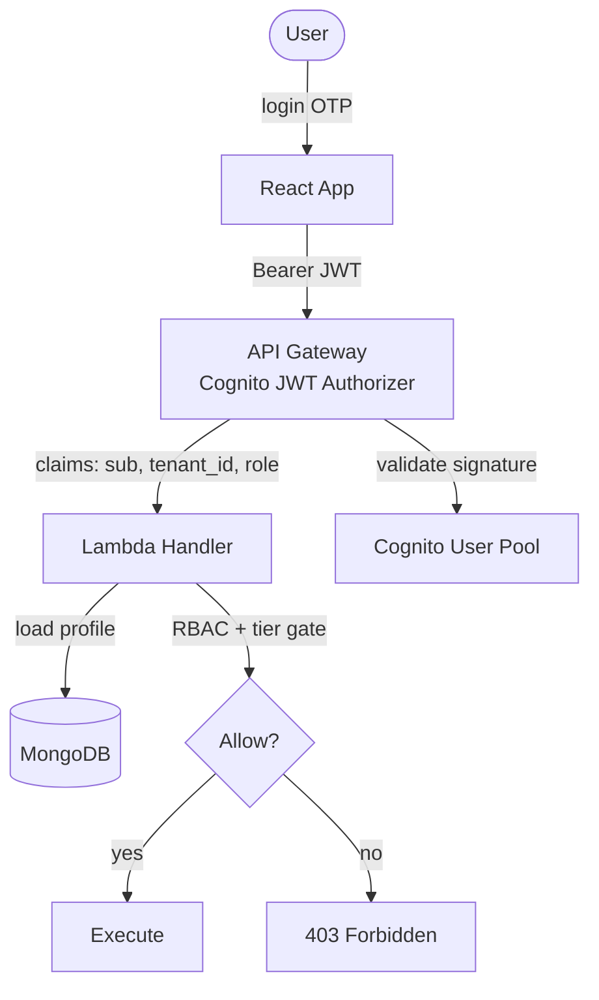
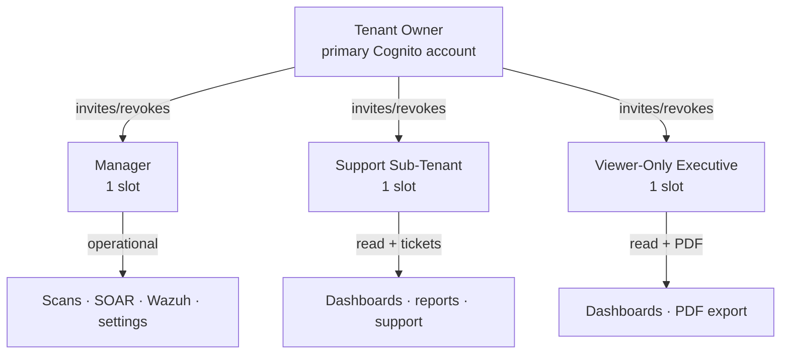
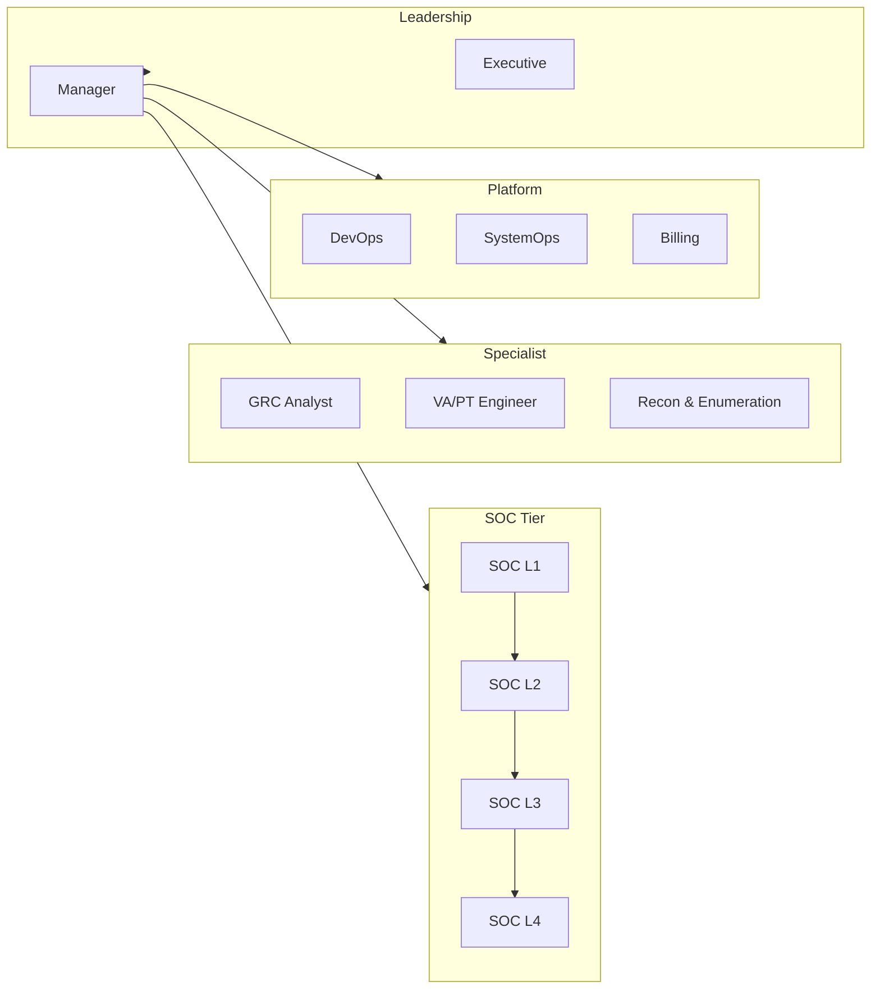
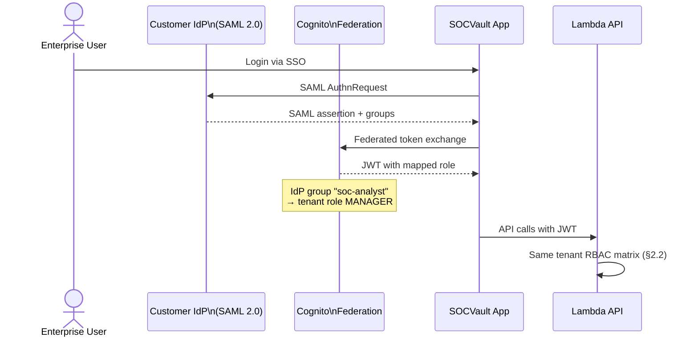

# SOCVault — RBAC Control Mapping
**Version 1.0 | June 2026**

Three **separate** RBAC models — never merge into one diagram ([`02_TECHNICAL_STACK.md`](../02_TECHNICAL_STACK.md) §2.7).

**Wireframes:** `21-tenant-teams.html` · `22-socvault-team-admin.html`

---

## 1. Auth flow — JWT to authorization



### JWT claims (conceptual)

| Claim | Source | Used for |
|---|---|---|
| `sub` | Cognito | User identity |
| `custom:tenant_id` | Cognito custom attribute | MongoDB partition filter |
| `custom:role` | Cognito / app | Tenant sub-user role (SUPPORT/VIEWER/MANAGER) |
| `custom:internal_role` | Internal staff only | 12-role internal RBAC |
| `cognito:groups` | Cognito | Super Admin group membership |

---

## 2. Tenant RBAC (Model A)

**Scope:** Single tenant workspace · **FR:** FR-140–150 · **Max sub-users:** 3 fixed slots

### 2.1 Role hierarchy



### 2.2 Permission matrix — tenant roles

| Resource / Action | Owner | Manager | Support | Viewer |
|---|:---:|:---:|:---:|:---:|
| Trigger scans (all layers) | ✅ | ✅ | ❌ | ❌ |
| View dashboards & reports | ✅ | ✅ | ✅ | ✅ |
| Download PDF reports | ✅ | ✅ | ✅ | ✅ |
| Manage settings (non-billing) | ✅ | ✅ | ❌ | ❌ |
| Approve SOAR playbooks | ✅ | ✅ | ❌ | ❌ |
| Deploy Wazuh agents | ✅ | ✅ | ❌ | ❌ |
| View billing summary | ✅ | ✅ | ❌ | ❌ |
| Change payment method | ✅ | ❌ | ❌ | ❌ |
| Delete account | ✅ | ❌ | ❌ | ❌ |
| Invite/revoke sub-users | ✅ | ❌ | ❌ | ❌ |
| Raise support tickets | ✅ | ✅ | ✅ | ❌ |

**FR refs:** FR-141 (Support), FR-142 (Viewer), FR-143 (Manager), FR-144 (Owner revoke)

### 2.3 Tier overlay (payment tier gates)

Tier gates apply **in addition to** role permissions (FR-101):

| Feature | Freemium | Starter | Pro | Enterprise |
|---|:---:|:---:|:---:|:---:|
| L1 Recon (1/month) | ✅ | ✅ | ✅ | ✅ |
| L2–L6 paid scans | ❌ | ✅ | ✅ | ✅ |
| L7 SOC / Wazuh | ❌ | ❌ | ✅ | ✅ |
| L8 Malware D&R | ❌ | ❌ | ✅ | ✅ |
| L9 AI Agent | ❌ | ❌ | ✅ | ✅ |
| SOAR automation | ❌ | ❌ | ✅ | ✅ |
| Compliance exports | ❌ | Partial | ✅ | ✅ |
| AI Chat credits | ❌ | ❌ | ✅ | ✅ |

---

## 3. Internal staff RBAC (Model B)

**Scope:** SOCVault operators · **FR:** FR-151–165 · **Wireframe:** `22-socvault-team-admin.html`

### 3.1 Role map



### 3.2 Permission matrix — internal roles (summary)

| Capability | L1 | L2 | L3 | L4 | GRC | VA/PT | Recon | DevOps | SysOps | Billing | Exec | Manager |
|---|:---:|:---:|:---:|:---:|:---:|:---:|:---:|:---:|:---:|:---:|:---:|:---:|
| Alert triage queue | ✅ | ✅ | ✅ | ✅ | — | — | — | — | — | — | — | ✅ |
| Incident analysis | RO | ✅ | ✅ | ✅ | — | — | — | — | — | — | — | ✅ |
| Playbook approval | — | — | ✅ | ✅ | — | — | — | — | — | — | — | ✅ |
| Cross-tenant threat hunt | — | — | — | ✅ | — | — | — | — | — | — | — | ✅ |
| Compliance all tenants | — | — | — | — | ✅ | — | — | — | — | — | RO | ✅ |
| Run scans any tenant | — | — | — | — | — | ✅ | ✅ | — | — | — | — | ✅ |
| Infra / deploy | — | — | — | — | — | — | — | ✅ | ✅ | — | — | ✅ |
| Platform health / DB ops | — | — | — | — | — | — | — | RO | ✅ | — | — | ✅ |
| Stripe / COGS / revenue | — | — | — | — | — | — | — | — | — | ✅ | RO | ✅ |
| KPI / MRR dashboards | — | — | — | — | — | — | — | — | — | RO | ✅ | ✅ |
| Metrics Observatory full | — | — | — | Lim | — | — | — | RO | RO | ✅ | RO | ✅ |
| API Explorer / Vault | — | — | — | — | — | — | — | ✅ | ✅ | — | — | ✅ |
| Team provisioning | — | — | — | — | — | — | — | — | — | — | — | ✅ |
| Audit log write (FR-165) | ✅ | ✅ | ✅ | ✅ | ✅ | ✅ | ✅ | ✅ | ✅ | ✅ | ✅ | ✅ |

**Legend:** ✅ full · RO read-only · Lim limited · — not permitted

**FR refs:** FR-152–FR-163 per role

---

## 4. Enterprise SSO RBAC (Model C — Phase 4+)

**FR:** FR-009 · **Roadmap:** Phase 4.2.1



### IdP group mapping (configurable per enterprise tenant)

| IdP Group | Maps to tenant role |
|---|---|
| `socvault-admin` | Owner equivalent (billing) |
| `socvault-operator` | Manager |
| `socvault-readonly` | Viewer |
| `socvault-support` | Support |

---

## 5. Super Admin vs tenant boundary

```mermaid
flowchart TB
  subgraph TenantRoutes["/api/v1/* — tenant JWT"]
    T1[/scan/*]
    T2[/dashboard/*]
    T3[/team/*]
  end

  subgraph AdminRoutes["/api/v1/admin/* — internal RBAC"]
    A1[/admin/explorer/*]
    A2[/admin/vault/*]
    A3[/admin/ti/feeds/*]
    A4[/admin/observatory/*]
    A5[/admin/dev-tracker/*]
  end

  TENANT[Tenant JWT\ntenant_id scoped] --> TenantRoutes
  STAFF[Internal JWT\ninternal_role] --> AdminRoutes

  TenantRoutes -.-x|403| AdminRoutes
  AdminRoutes -->|cross-tenant + audit FR-165| ALL[(All tenants read)]
```

---

## 6. Super Admin overrides

| Override | Role required | Audit |
|---|---|---|
| Rate limit bypass (FR-119) | Super Admin / Manager | Justification required |
| Cross-tenant scan (VA/PT) | VA/PT Engineer | FR-165 |
| Vault secret reveal | DevOps / Manager | audit_log |
| Production Terraform apply | DevOps + approval | CI/CD log |

---

## Related documents

| Doc | Role |
|---|---|
| [`02_SYSTEM_FLOWS.md`](./02_SYSTEM_FLOWS.md) | Auth sequences |
| [`09_API_SURFACE.md`](./09_API_SURFACE.md) | Route groups by auth |
| [`08_TRUST_AND_SECURITY.md`](./08_TRUST_AND_SECURITY.md) | Trust boundaries |
