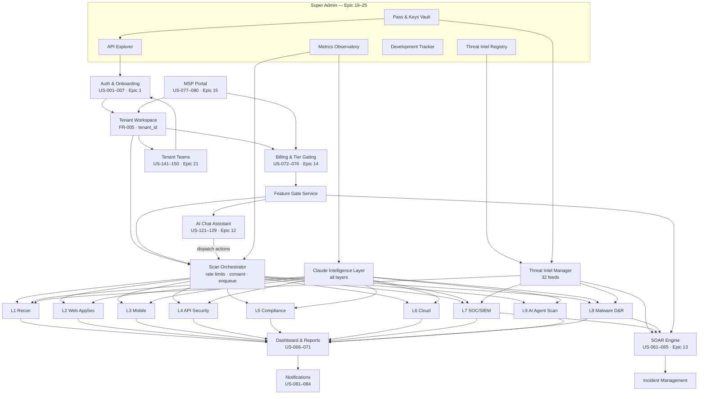
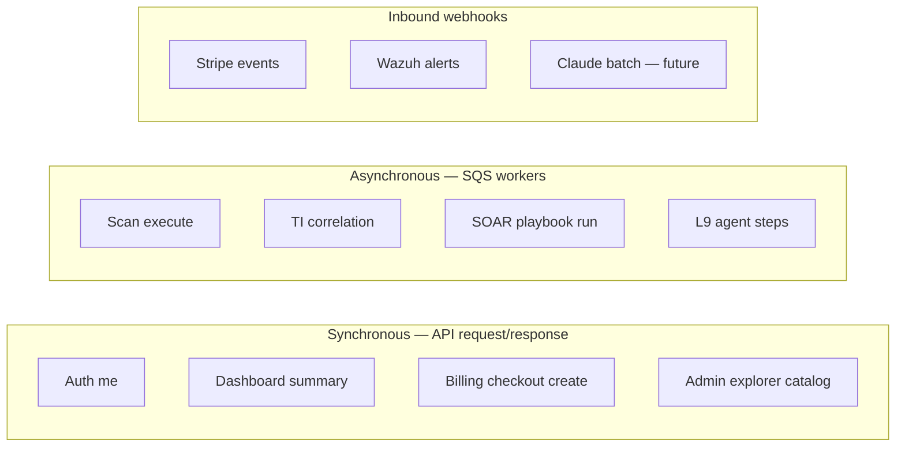
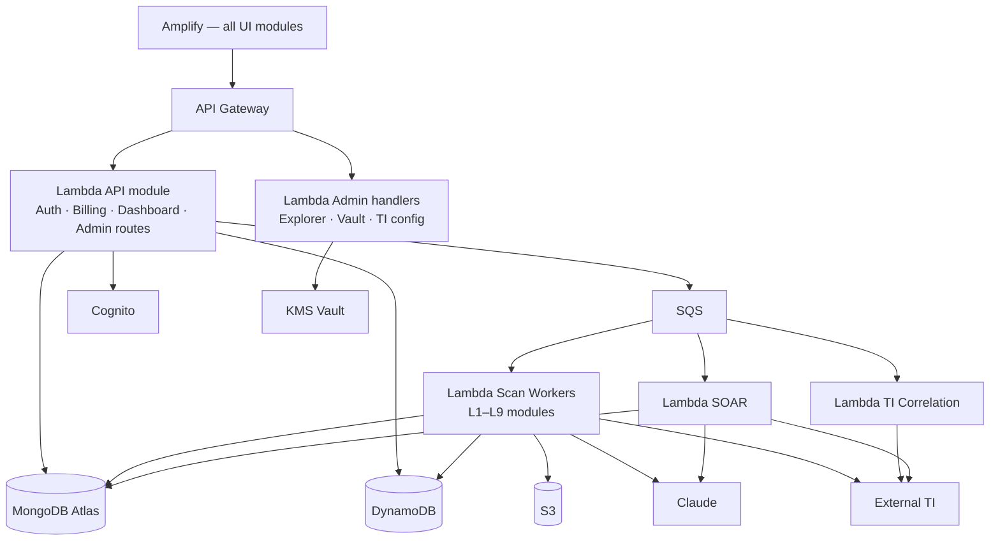
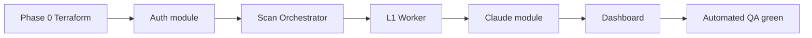

# SOCVault — Module Connectivity Mapping
**Version 1.0 | June 2026**

Logical **product module** dependency graph — how epics connect, not AWS service wiring (see [`01_C4_CONTEXT_CONTAINER.md`](./01_C4_CONTEXT_CONTAINER.md)).

**Traceability:** 26 epics · [`16_TRACEABILITY_MATRIX.md`](../16_TRACEABILITY_MATRIX.md)

---

## 1. Module dependency graph (product level)

---

## 2. Module interaction legend

| Edge type | Meaning | Example |
|---|---|---|
| Solid arrow | Direct dependency / calls | Orchestrator → L1 Worker |
| Dashed (conceptual) | Shared service used by many | Claude → all scan layers |
| Bidirectional | Data read/write | Dashboard ↔ MongoDB scans |

---

## 3. Module catalogue

| Module | Epic / US range | Primary stores | External deps |
|---|---|---|---|
| Auth & Onboarding | US-001–007 | Cognito, MongoDB `tenants` | SNS |
| Tenant Workspace | FR-005 | MongoDB `tenants` | — |
| Scan Orchestrator | US-008+ | SQS, DynamoDB limits | — |
| L1–L9 Workers | Per layer | S3, MongoDB `scans` | Scanner tools |
| Claude Intelligence | FR-040–047 | DynamoDB COGS | Anthropic API |
| Threat Intel Manager | US-201–208 | DynamoDB `ti_cache` | 32 feeds (doc 20) |
| Dashboard & Reports | US-066–071 | MongoDB `scans` | Claude (cached) |
| Billing & Tier Gating | US-072–076 | MongoDB, Stripe | Stripe webhooks |
| SOAR Engine | US-061–065 | MongoDB `incidents` | Wazuh, Claude |
| AI Chat Assistant | US-121–129 | MongoDB credits | Claude tools API |
| Tenant Teams | US-141–150 | MongoDB `sub_users` | Cognito |
| Notifications | US-081–084 | MongoDB, SNS | SNS/email |
| API Explorer | US-183–193 | DynamoDB vault | Proxy to staging API |
| Pass & Keys Vault | US-183+ | DynamoDB + KMS | KMS |
| Threat Intel Registry | US-201–208 | MongoDB/DynamoDB config | — |
| Metrics Observatory | US-170–182 | DynamoDB COGS | CloudWatch |
| Development Tracker | US-194–200 | MongoDB / markdown sync | Git export |
| MSP Portal | US-077–080 | MongoDB multi-tenant | Channel billing |

---

## 4. Sync vs async connectivity

---

## 5. Infrastructure connectivity (deployable modules)

Maps product modules to AWS containers — complements C4 Container diagram.

---

## 6. Phase connectivity (when modules land)

| Phase | Modules activated | New edges |
|---|---|---|
| Phase 0 | CI/CD, Terraform, health | Engineer → staging |
| Phase 1 | Auth, L1, Claude, Dashboard, Admin telemetry | Tenant → Orchestrator → L1 → Dashboard |
| Phase 2 | Billing, L2–L8, SOAR, Domain verify, Teams | Billing → GATES → Orchestrator |
| Phase 2.8–2.11 | Observatory, API Explorer, TI Registry | Admin → TI → Scan workers |
| Phase 3 | AI Chat, MSP, L9 production | Chat → Orchestrator |
| Phase 4 | SSO, Enterprise RBAC | IdP → Auth → Teams matrix |
| Phase 5 | EKS workers, multi-region | Orchestrator → EKS jobs |

---

## 7. Critical path for MVP build

**Build order:** [`23_MVP_BUILD_ORDER_AND_QA.md`](../23_MVP_BUILD_ORDER_AND_QA.md)

---

## Related documents

| Doc | Role |
|---|---|
| [`06_SCAN_LAYERS.md`](./06_SCAN_LAYERS.md) | Per-layer detail |
| [`02_SYSTEM_FLOWS.md`](./02_SYSTEM_FLOWS.md) | Runtime sequences |
| [`05_PRODUCT_ROADMAP.md`](../05_PRODUCT_ROADMAP.md) | Phase gates |
