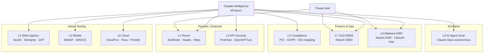
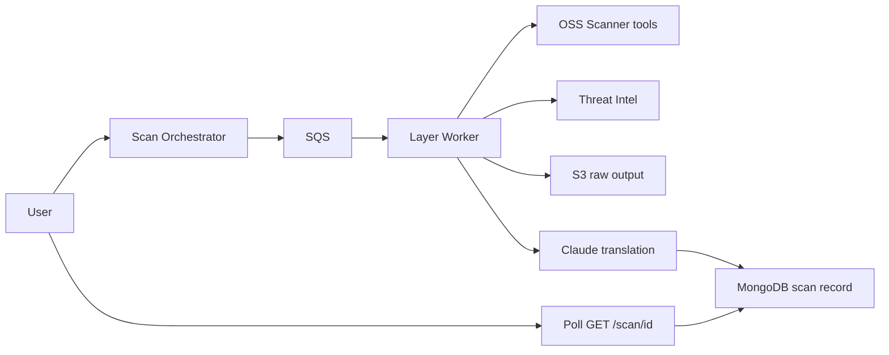
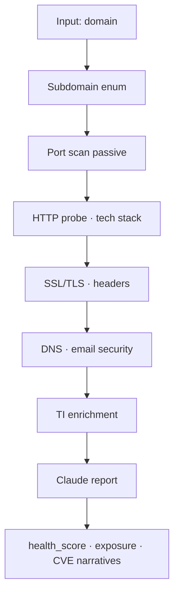
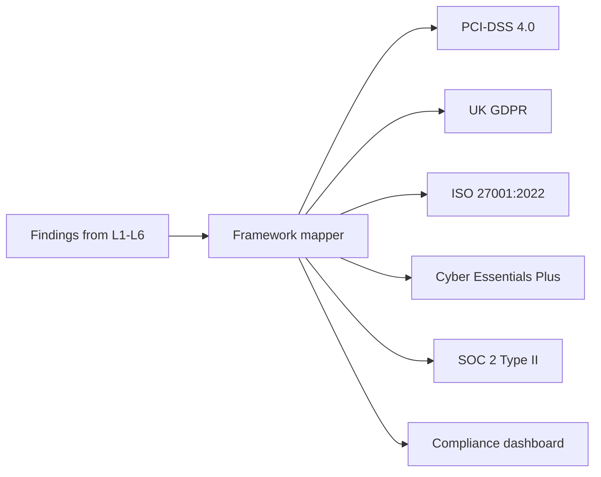
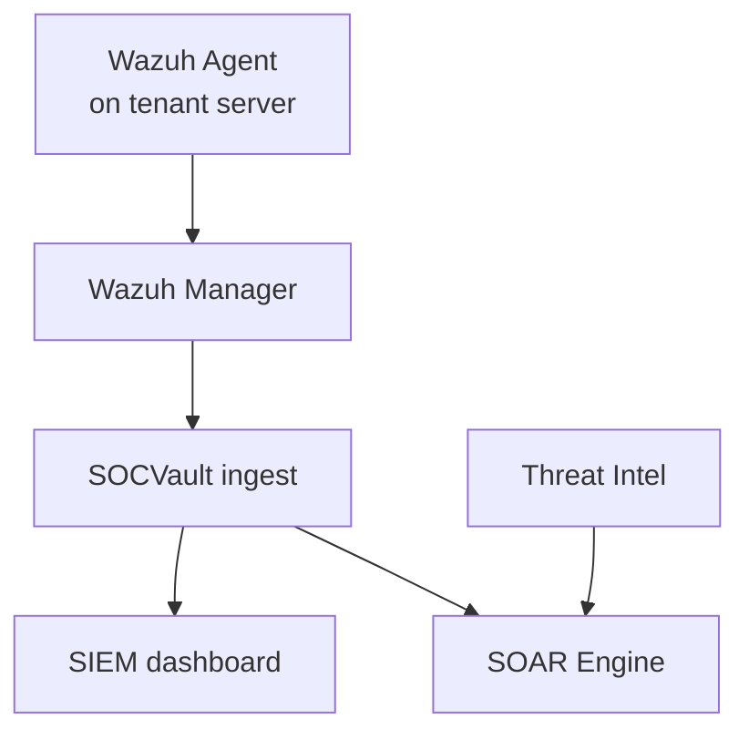
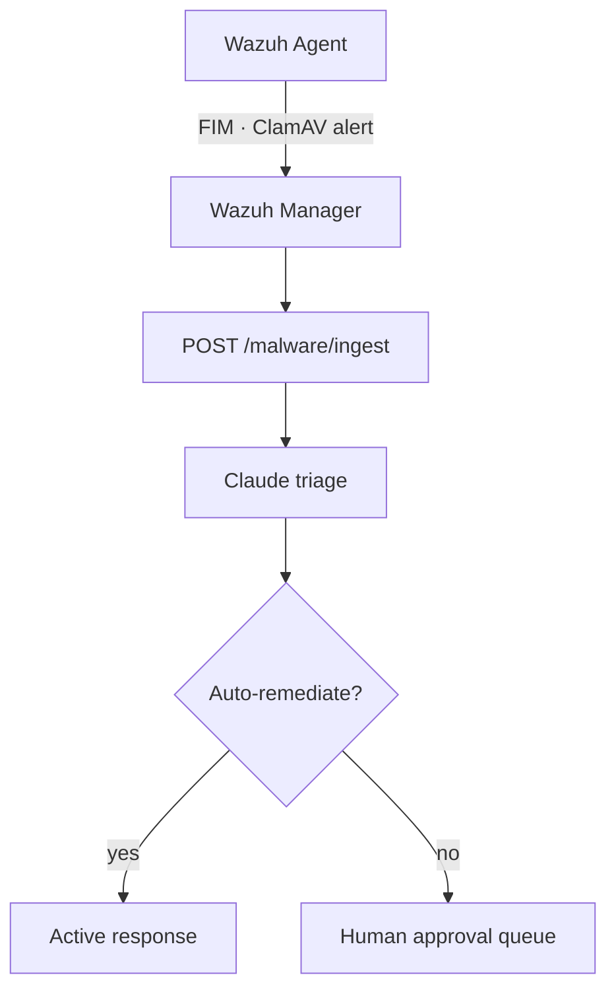
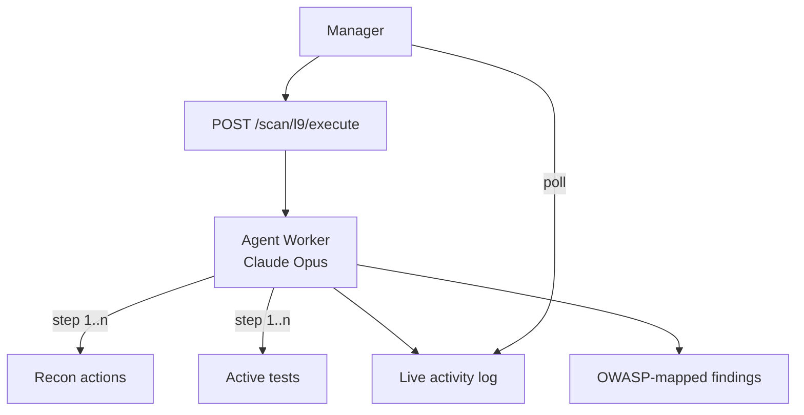
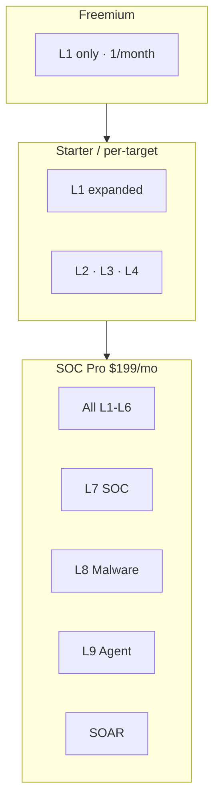

# SOCVault — Scan Layers L1–L9 Reference
**Version 1.0 | June 2026**

Per-layer catalogue: tools, tier, rate limits, data flows, wireframes. **8 core layers + L9 AI Agent Scan.**

**FR rate limits:** FR-110–115 · **Wireframes:** `03`–`11`, `20`

---

## 1. Layer overview map

---

## 2. Layer reference table

| Layer | Name | Key tools | Min tier | Rate limit | Wireframe | US range |
|---|---|---|---|---|---|---|
| **L1** | External Recon | Subfinder, Naabu, httpx, dnsx | Freemium | 1/month free · 2/7d paid | `03`, `04` | US-008–020 |
| **L2** | Web AppSec | Nuclei, Semgrep, OWASP ZAP | Starter+ | 1/15 days | `05` | US-021–026 |
| **L3** | Mobile AppSec | MobSF, MASVS checker | Starter+ | 1/15 days | `06` | US-027–029 |
| **L4** | API Security | OpenAPI fuzz, auth testing | Starter+ | 2/7 days | `07` | US-030–032 |
| **L5** | Compliance | Framework mappers, policy gaps | Pro+ | 1/30 days | `08` | US-033–036 |
| **L6** | Cloud Pentest | CloudFox, Pacu, Prowler | Pro+ | 1/15 days | `09` | US-037–040 |
| **L7** | SOC / SIEM | Wazuh manager + agents | SOC Pro | Continuous ingest | `10` | US-041–045 |
| **L8** | Malware D&R | Wazuh FIM, ClamAV, YARA | SOC Pro | Event-driven | `11` | US-046–054 |
| **L9** | AI Agent Scan | Claude Opus extended thinking | Pro+ (Ph2) | 1/7 days | `20` | US-130–140 |

---

## 3. Per-layer data flow pattern (common template)

All scan layers follow this pattern unless noted (L7/L8 are event-driven):

---

## 4. L1 — External Recon (MVP)

| Step | Tool | Output store |
|---|---|---|
| 15-step pipeline | Subfinder, Naabu, httpx, etc. | S3 + MongoDB |
| AI translation | claude-sonnet-4-6 | MongoDB `executive_report` |
| Freemium gate | FR-026 | DynamoDB rate limit |

---

## 5. L2 — Web AppSec

| Phase | Activity |
|---|---|
| Discovery | Crawl sitemap, identify endpoints |
| SAST | Semgrep rulesets |
| DAST | Nuclei templates, ZAP active scan |
| AI | Claude maps to OWASP Top 10 + business risk |

**Consent:** Domain verified (FR-029) · **COGS:** ~$0.36/scan fully loaded

---

## 6. L3 — Mobile

| Input | Process |
|---|---|
| APK/IPA upload | MobSF static + dynamic analysis |
| Output | MASVS report, AI risk summary |

**API:** `POST /scan/mobile` · **Storage:** S3 encrypted binary (tenant-scoped)

---

## 7. L4 — API Security

| Input | Process |
|---|---|
| OpenAPI spec or discovered endpoints | Auth bypass, injection, rate limit tests |
| Output | Endpoint risk map, Claude remediation scripts (paywalled Pro+) |

---

## 8. L5 — Compliance

**USP 8:** All five frameworks included in paid tier — not add-on.

---

## 9. L7 — SOC / SIEM

**Deployment:** Wazuh manager on EKS/EC2 (paid tier) · Agents deployed by Manager role (FR-143)

---

## 10. L8 — Malware Detection & Response

---

## 11. L9 — AI Agent Scan (Phase 2)

| Property | Value |
|---|---|
| Model | Claude Opus (extended thinking) |
| Limit | 1 scan / 7 days (FR-115) |
| Cost cap | FR-132 real-time against tenant AI budget |

---

## 12. Layer vs tier matrix

---

## 13. Equivalent multi-vendor stack (competitive context)

| Layer | Typical point solution | SOCVault |
|---|---|---|
| L1 | Shodan, Censys | Included |
| L2 | Intruder.io, Detectify | Included |
| L3 | NowSecure, GuardSquare | Included |
| L4 | 42Crunch, Salt | Included |
| L5 | Vanta, Drata (partial) | Included |
| L6 | ScoutSuite, Prowler SaaS | Included |
| L7 | Blumira, Huntress | Included @ $199 |
| L8 | CrowdStrike (SMB tier) | Included @ $199 |
| L9 | Pentest-as-a-service | AI agent @ Pro |

---

## Related documents

| Doc | Role |
|---|---|
| [`20_FREE_EXTERNAL_APIS.md`](../20_FREE_EXTERNAL_APIS.md) | TI feeds per layer |
| [`03_DATA_FLOW_EXTENDED.md`](./03_DATA_FLOW_EXTENDED.md) | L2/L9 DFD detail |
| [`22_DATA_FLOW_DIAGRAMS.md`](../22_DATA_FLOW_DIAGRAMS.md) | L1 MVP pipeline |
