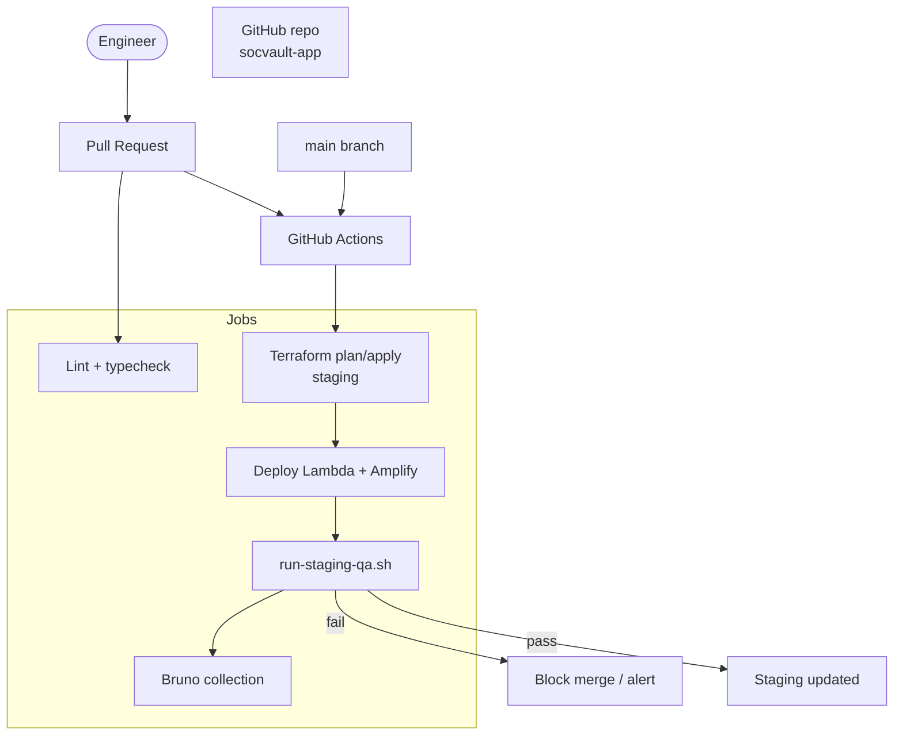
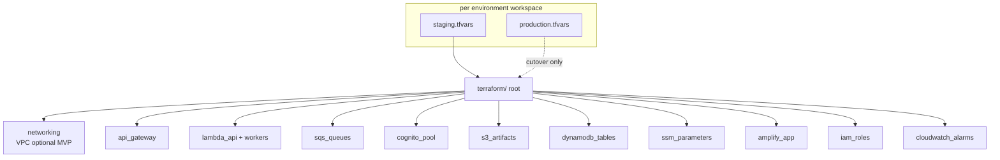
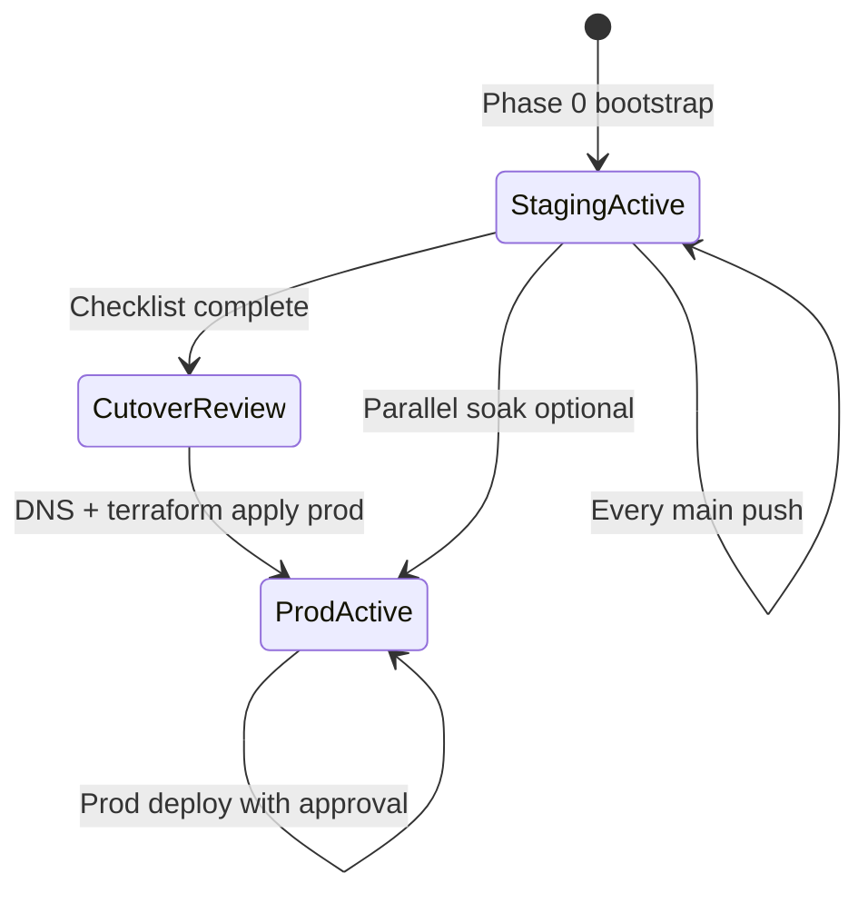
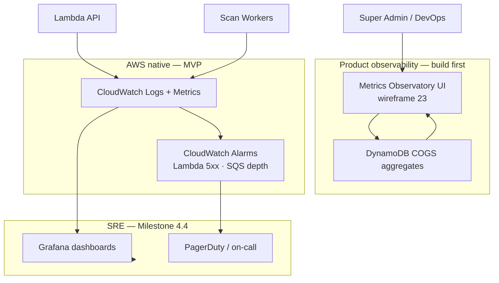
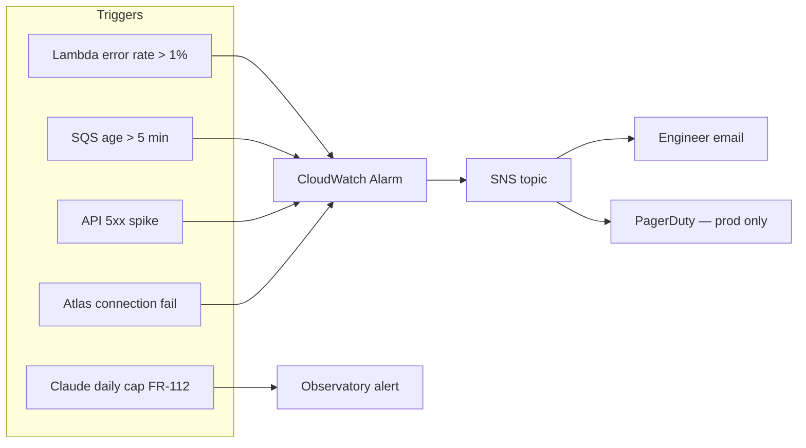
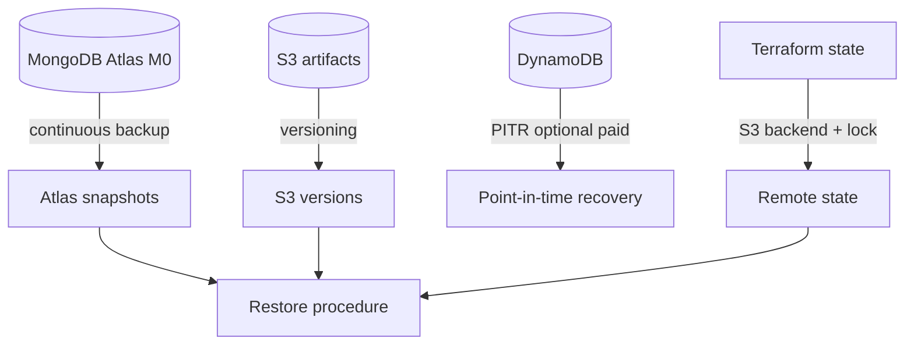
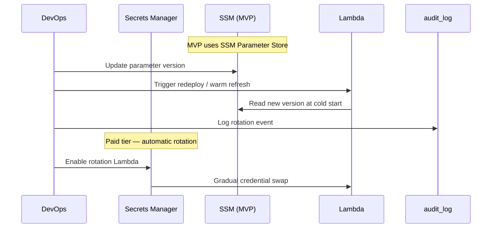
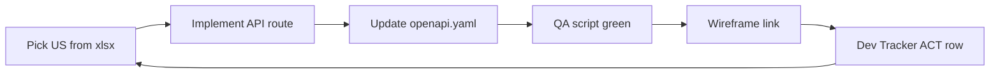
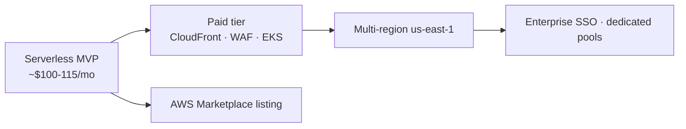

# SOCVault — Ops, CI/CD & Observability
**Version 1.0 | June 2026**

Deployment, environment promotion, monitoring, and disaster recovery flows.

**Related:** [`19_CI_CD_AND_ENVIRONMENTS.md`](../19_CI_CD_AND_ENVIRONMENTS.md) · [`23_MVP_BUILD_ORDER_AND_QA.md`](../23_MVP_BUILD_ORDER_AND_QA.md) · ADR-006

---

## 1. CI/CD pipeline (staging MVP)

---

## 2. Terraform module map

---

## 3. Environment promotion flow

### Cutover checklist (summary)

| # | Gate |
|---|---|
| 1 | Staging Bruno + `run-staging-qa.sh` green 7 consecutive days |
| 2 | Security review / threat model sign-off |
| 3 | Production Cognito pool + MongoDB provisioned (isolated) |
| 4 | DNS `api.socvault.io` + `app.socvault.io` |
| 5 | Post-cutover smoke QA on production |
| 6 | Rollback plan documented |

**Detail:** [`23_MVP_BUILD_ORDER_AND_QA.md`](../23_MVP_BUILD_ORDER_AND_QA.md) §7

---

## 4. Observability architecture

| Tool | Audience | Metrics |
|---|---|---|
| Metrics Observatory | Super Admin, Billing, Exec | MRR vs COGS, Claude spend, per-tenant caps |
| CloudWatch | DevOps | Lambda duration, errors, API latency |
| Grafana | SRE | Throughput, queue depth, Atlas connections |

**Rule ([`02_TECHNICAL_STACK.md`](../02_TECHNICAL_STACK.md) §2.8):** Observatory first for operator UX; Grafana supplements for production SRE.

---

## 5. Alert routing

---

## 6. Backup & disaster recovery

| Asset | RPO target | RTO target |
|---|---|---|
| MongoDB tenants/scans | 24h (M0 snapshot) | 4h |
| S3 scan artifacts | Real-time versioning | 1h |
| Terraform state | Per commit | 30 min |
| Cognito users | Export weekly | 2h |

---

## 7. Secret rotation flow (paid tier)

---

## 8. User story build loop (operational)

**Rule:** One user story at a time · API-first · staging QA green before next story ([`23_MVP_BUILD_ORDER_AND_QA.md`](../23_MVP_BUILD_ORDER_AND_QA.md))

---

## 9. Scaling path (Free Tier → paid)

| Stage | Architecture | ~Monthly cost |
|---|---|---|
| MVP staging | API GW + Lambda + Amplify + SQS | $100–115 |
| Paid tier | + CloudFront, WAF, EKS workers | $433+ |
| Scale | + us-east-1, ElastiCache | Custom |

---

## Related documents

| Doc | Role |
|---|---|
| [`01_C4_CONTEXT_CONTAINER.md`](./01_C4_CONTEXT_CONTAINER.md) | Container view |
| [`22_DATA_FLOW_DIAGRAMS.md`](../22_DATA_FLOW_DIAGRAMS.md) §7 | CI/CD DFD |
| [`DEVELOPMENT_TRACKER.md`](../../DEVELOPMENT_TRACKER.md) | Live stack status |
