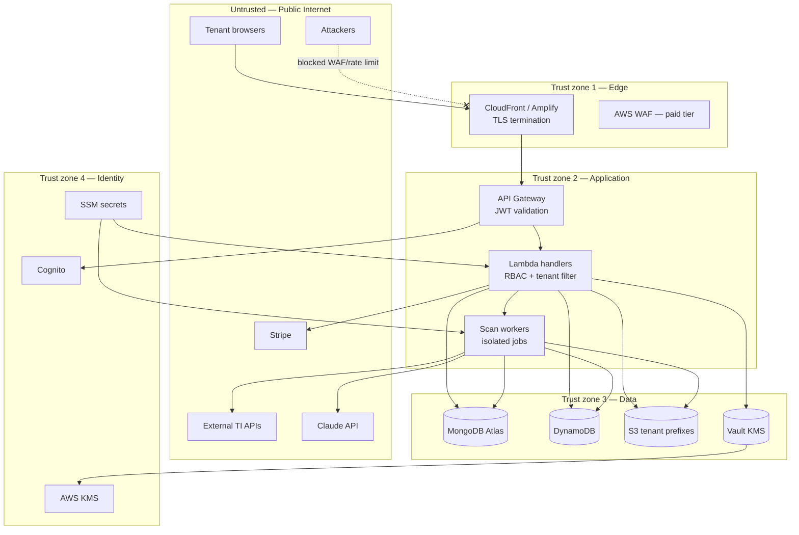
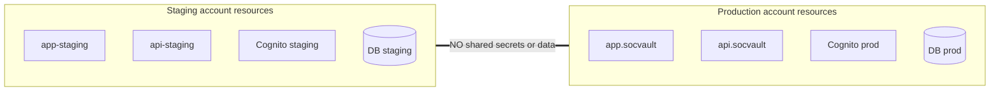
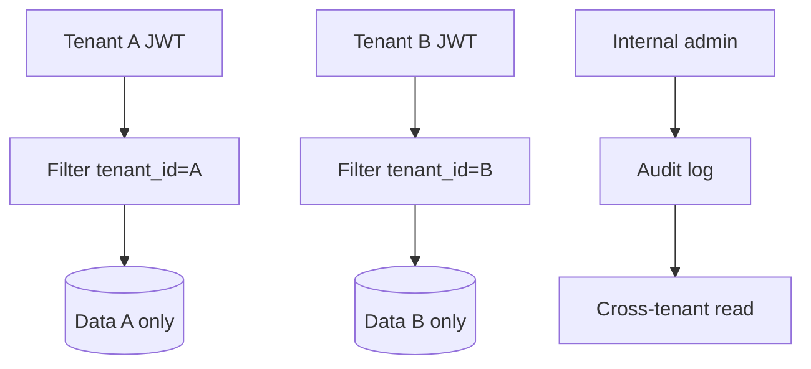
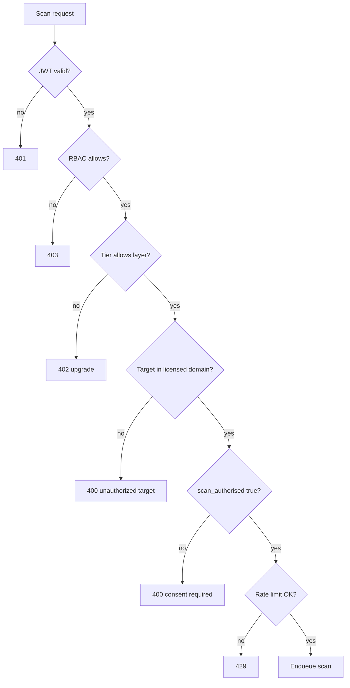
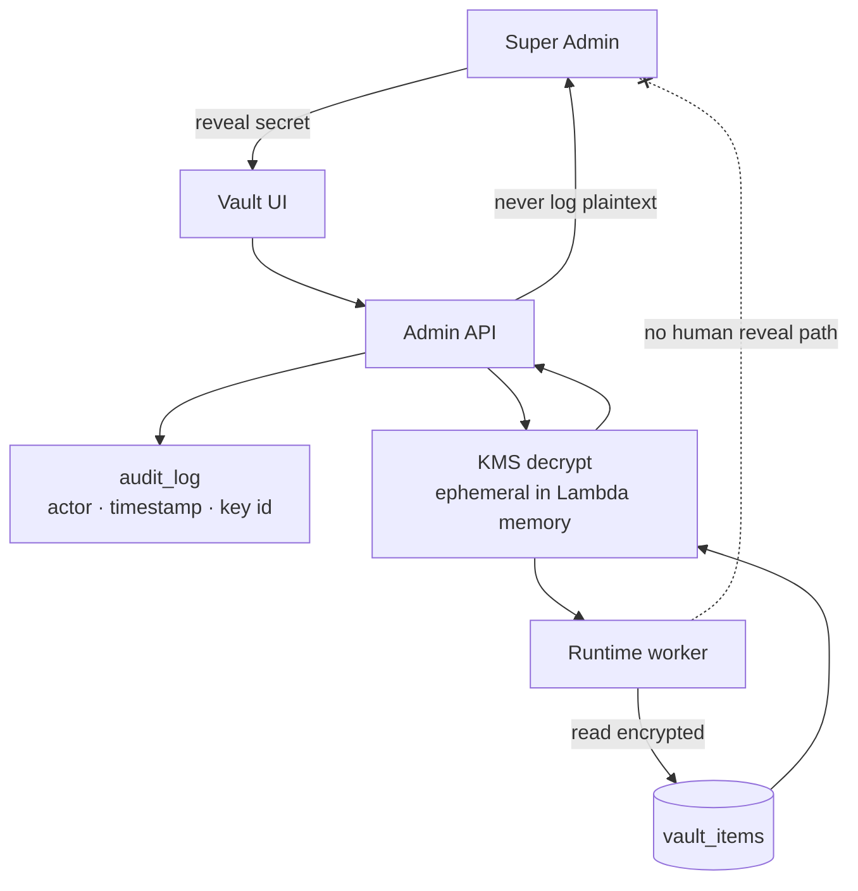

# SOCVault — Trust Boundaries & Security Architecture
**Version 1.0 | June 2026**

Trust zones, data classification, and security control mapping. Companion to [`14_THREAT_MODEL.md`](../14_THREAT_MODEL.md) (STRIDE).

---

## 1. Trust zone diagram

---

## 2. Staging vs production boundary

**ADR-006:** Production dormant until cutover. No cross-environment data replication except intentional migration scripts with audit.

---

## 3. Tenant isolation boundary

| Control | Implementation | FR/NFR |
|---|---|---|
| Identity partition | `tenant_id` Cognito custom attribute | FR-005 |
| Data partition | MongoDB queries always filter `tenant_id` | NFR-025 |
| Object storage | S3 key prefix `{tenant_id}/` | NFR-025 |
| Scan isolation | Separate Lambda invocation per job | FR-030 |
| Cross-tenant admin | Internal RBAC + audit log | FR-155, FR-165 |
| Rate limits | DynamoDB per `tenant_id` + module | FR-120 |

---

## 4. Admin vs tenant API boundary

| Zone | Path prefix | Auth | Data scope |
|---|---|---|---|
| Tenant | `/api/v1/auth/*`, `/scan/*`, `/dashboard/*` | Tenant JWT | Own `tenant_id` only |
| Admin | `/api/v1/admin/*` | Internal role JWT | Cross-tenant with RBAC |
| Webhook | `/api/v1/incidents/ingest`, `/malware/ingest` | HMAC / API key | Validated agent → tenant |
| Public | `/health` | None | No sensitive data |

---

## 5. Data classification

| Class | Examples | Stores | Encryption |
|---|---|---|---|
| **PII** | Email, phone, domain | MongoDB `tenants` | TLS + Atlas encryption |
| **Sensitive** | Scan findings, IOCs | MongoDB, S3 | TLS + at-rest |
| **Secrets** | TI API keys, Stripe | DynamoDB vault, SSM | KMS envelope |
| **Telemetry** | COGS, token counts | DynamoDB | At-rest AWS default |
| **Public** | Health check, marketing | — | TLS only |

---

## 6. Scan authorization boundary

**FR chain:** FR-101, FR-028, FR-029, FR-110–120

---

## 7. Vault trust boundary

---

## 8. STRIDE mapping (summary)

| STRIDE | Primary boundary | Mitigation |
|---|---|---|
| **Spoofing** | Cognito JWT | API Gateway authorizer, short-lived tokens |
| **Tampering** | Scan results, webhooks | Immutable scan records, HMAC on Wazuh ingest |
| **Repudiation** | Admin actions | audit_log FR-165, CloudTrail |
| **Information disclosure** | Cross-tenant queries | Mandatory tenant_id filter, KMS vault |
| **Denial of service** | API + scan queue | Rate limits, SQS backpressure, per-tenant caps |
| **Elevation of privilege** | Sub-user roles, admin | Separate RBAC models, least privilege |

**Full catalogue:** [`14_THREAT_MODEL.md`](../14_THREAT_MODEL.md)

---

## 9. Compliance control overlay

| Framework | Diagram evidence |
|---|---|
| ISO 27001 | Trust zones §1, audit §7, isolation §3 |
| UK GDPR | PII classification §5, tenant partition §3 |
| PCI-DSS 4.0 | Scan authorization §6, encryption §5 |
| SOC 2 Type II | CI/CD §07_OPS, logging §8 |
| Cyber Essentials | WAF edge §1, access control doc 04 |

---

## Related documents

| Doc | Role |
|---|---|
| [`04_RBAC_MAPPING.md`](./04_RBAC_MAPPING.md) | Access control detail |
| [`03_DATA_FLOW_EXTENDED.md`](./03_DATA_FLOW_EXTENDED.md) | Isolation DFD |
| [`14_THREAT_MODEL.md`](../14_THREAT_MODEL.md) | Full STRIDE |
