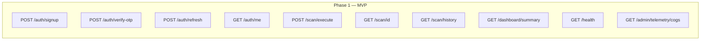
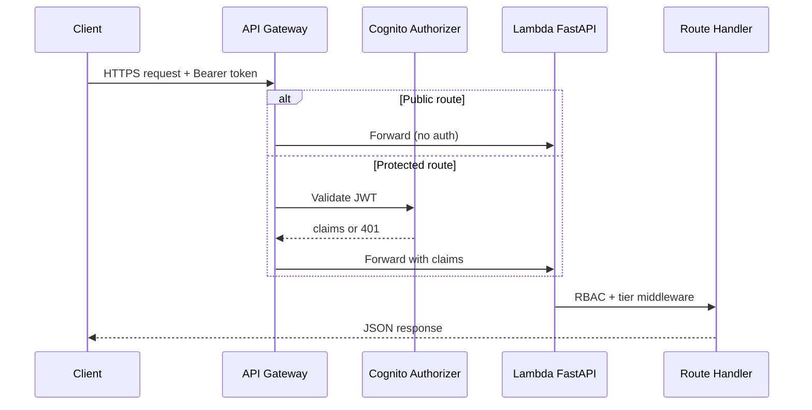

# SOCVault — API Surface Map
**Version 1.0 | June 2026**

REST route grouping by module, auth requirement, and build phase. Authoritative contracts: [`api/openapi.yaml`](../../api/openapi.yaml) · [`06_API_SPECIFICATION.md`](../06_API_SPECIFICATION.md).

**Base URL (staging MVP):** `https://api-staging.socvault.io/api/v1`

---

## 1. API module map

```mermaid
flowchart TB
  ROOT[/api/v1]

  ROOT --> AUTH[Auth\n/auth/*]
  ROOT --> SCAN[Scans\n/scan/*]
  ROOT --> DASH[Dashboard\n/dashboard/*]
  ROOT --> INC[Incidents\n/incidents/*]
  ROOT --> MAL[Malware\n/malware/*]
  ROOT --> BILL[Billing\n/billing/*]
  ROOT --> TEAM[Teams\n/team/*]
  ROOT --> CHAT[AI Chat\n/ai/* · /credits/*]
  ROOT --> SET[Settings\n/settings/*]
  ROOT --> AUDIT[Audit\n/audit/*]
  ROOT --> ADMIN[Admin\n/admin/*]
  ROOT --> HEALTH[Health\n/health]

  AUTH --> P1[Phase 1]
  SCAN --> P1 & P2 & P3
  DASH --> P1 & P2
  INC & MAL --> P2
  BILL & TEAM --> P2
  CHAT --> P3
  ADMIN --> P1T[Phase 1 telemetry] & P2A[Phase 2.9+ admin]
```

---

## 2. Auth requirements by group

| Group | Prefix | Auth | RBAC |
|---|---|---|---|
| Public | `/health`, `/auth/signup`, `/auth/verify-otp` | None | — |
| Tenant session | `/auth/refresh`, `/auth/me` | Bearer JWT | Owner default |
| Tenant ops | `/scan/*`, `/dashboard/*`, `/settings/*` | Bearer JWT | Role + tier |
| Tenant billing | `/billing/*` | Bearer JWT | Owner only |
| Tenant teams | `/team/*` | Bearer JWT | Owner invite; sub-user read |
| Webhooks | `/incidents/ingest`, `/malware/ingest` | API key / HMAC | Agent → tenant map |
| Admin | `/admin/*` | Internal JWT | 12-role matrix |
| AI Chat | `/ai/*`, `/credits/*` | Bearer JWT | Pro+ tier |

---

## 3. Phase 1 MVP routes (build first)



| Priority | Method | Path | Module |
|---|---|---|---|
| 1 | GET | `/health` | Platform |
| 2 | POST | `/auth/signup` | Auth |
| 3 | POST | `/auth/verify-otp` | Auth |
| 4 | GET | `/auth/me` | Auth |
| 5 | POST | `/scan/execute` | L1 Scan |
| 6 | GET | `/scan/{scan_id}` | L1 Scan |
| 7 | GET | `/dashboard/summary` | Dashboard |

---

## 4. Phase 2 routes

| Group | Key routes |
|---|---|
| Domain verify | `POST /auth/domain/verify`, `GET /auth/domain/status` |
| Billing | `POST /billing/checkout`, `POST /billing/webhook`, `GET /billing/invoices` |
| SOAR | `POST /incidents/ingest`, `GET /incidents`, `POST /incidents/{id}/approve` |
| Malware | `POST /malware/ingest`, `GET /malware/incidents` |
| L9 | `POST /scan/l9/execute`, `GET /scan/l9/{id}/log` |
| Teams | `POST /team/invite`, `DELETE /team/{user_id}` |
| Compliance dash | `GET /dashboard/compliance` |
| Admin Explorer | `/admin/explorer/*`, `/admin/vault/*` |
| Admin TI | `/admin/ti/feeds/*` |

---

## 5. Phase 3+ routes

| Group | Key routes |
|---|---|
| AI Chat | `POST /ai/chat`, `GET /credits/balance`, `POST /credits/purchase` |
| Mobile L3 | `POST /scan/mobile` |
| MSP | `/msp/tenants/*`, `/msp/billing/*` |
| Benchmark | `GET /dashboard/benchmark` |
| Observatory | `/admin/observatory/*` |
| Dev Tracker | `/admin/dev-tracker/*` |

---

## 6. Request flow through API Gateway



---

## 7. Rate limit keys (DynamoDB)

| Key pattern | Scope | FR |
|---|---|---|
| `{tenant_id}#L1#month` | Freemium monthly | FR-026 |
| `{tenant_id}#L2#rolling15d` | Web scan | FR-111 |
| `{ip}#global#minute` | DDoS protection | NFR-027 |
| `{tenant_id}#ai#daily` | Claude cap | FR-112 |

---

## 8. OpenAPI ↔ wireframe ↔ user story traceability

| API group | Wireframe | US range |
|---|---|---|
| `/auth/*` | `01-onboarding.html` | US-001–007 |
| `/scan/*` L1 | `03`, `04` | US-008–020 |
| `/dashboard/*` | `02-dashboard.html` | US-066–071 |
| `/billing/*` | `14-billing.html` | US-072–076 |
| `/incidents/*` | `13-soar.html` | US-061–065 |
| `/admin/explorer/*` | `24-admin-api-explorer.html` | US-183–193 |
| `/admin/dev-tracker/*` | `25-admin-dev-tracker.html` | US-194–200 |
| `/admin/ti/*` | TI registry UI | US-201–208 |

Full matrix: [`16_TRACEABILITY_MATRIX.md`](../16_TRACEABILITY_MATRIX.md)

---

## Related documents

| Doc | Role |
|---|---|
| [`04_RBAC_MAPPING.md`](./04_RBAC_MAPPING.md) | Who can call each group |
| [`05_MODULE_CONNECTIVITY.md`](./05_MODULE_CONNECTIVITY.md) | Module dependencies |
| [`23_MVP_BUILD_ORDER_AND_QA.md`](../23_MVP_BUILD_ORDER_AND_QA.md) | Build sequence |
