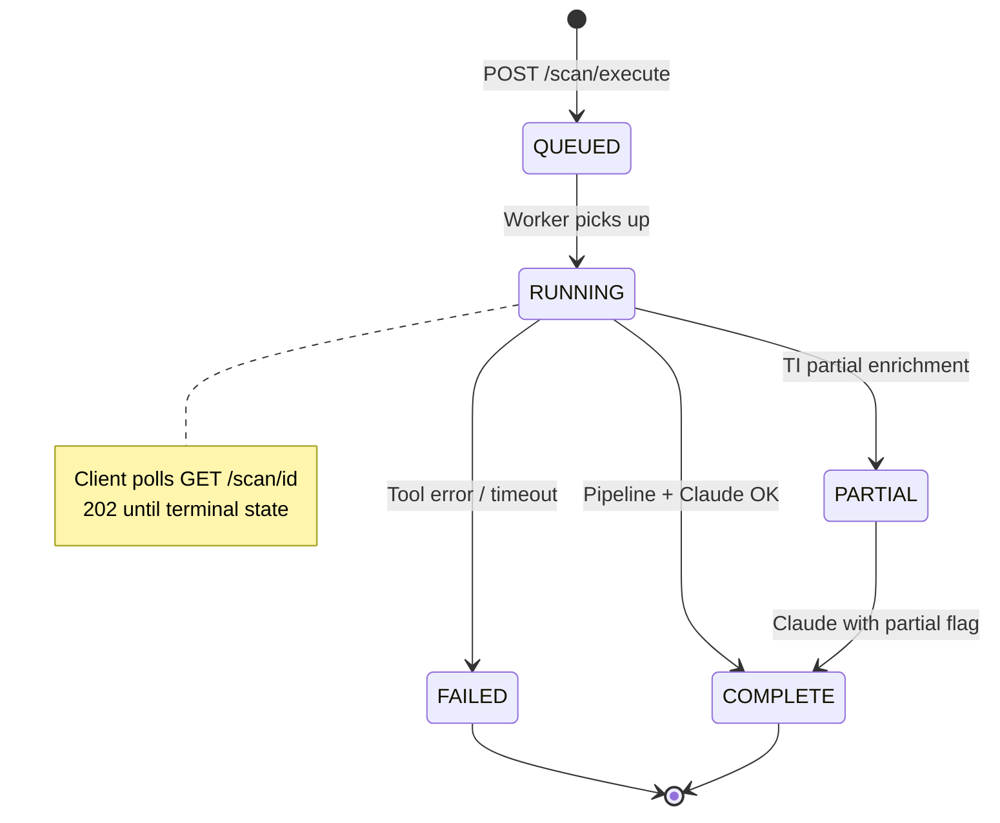
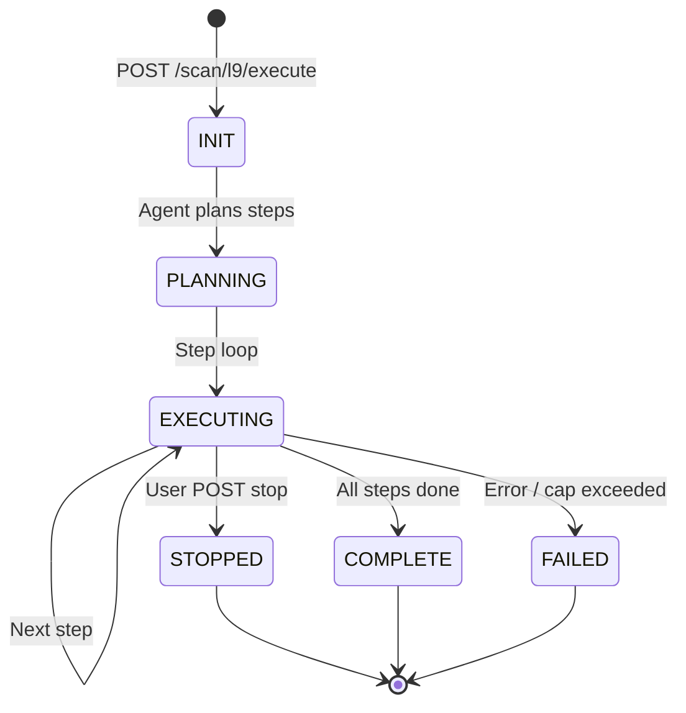
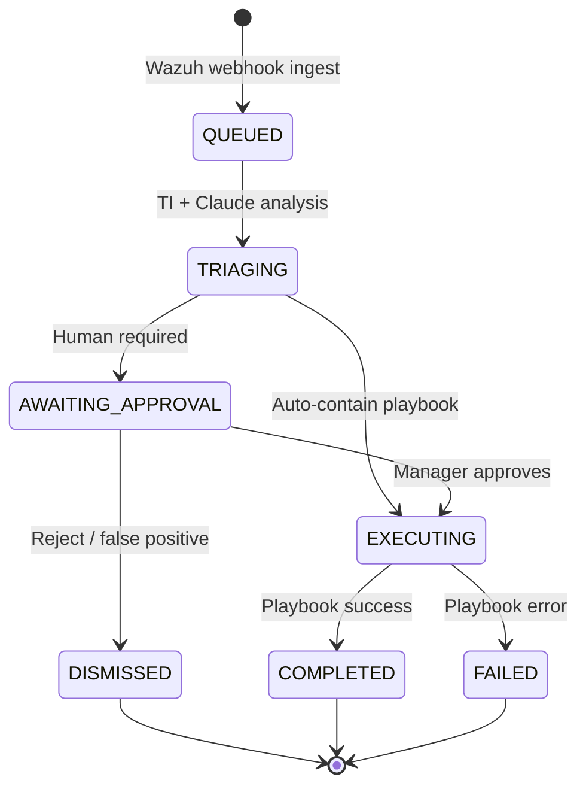
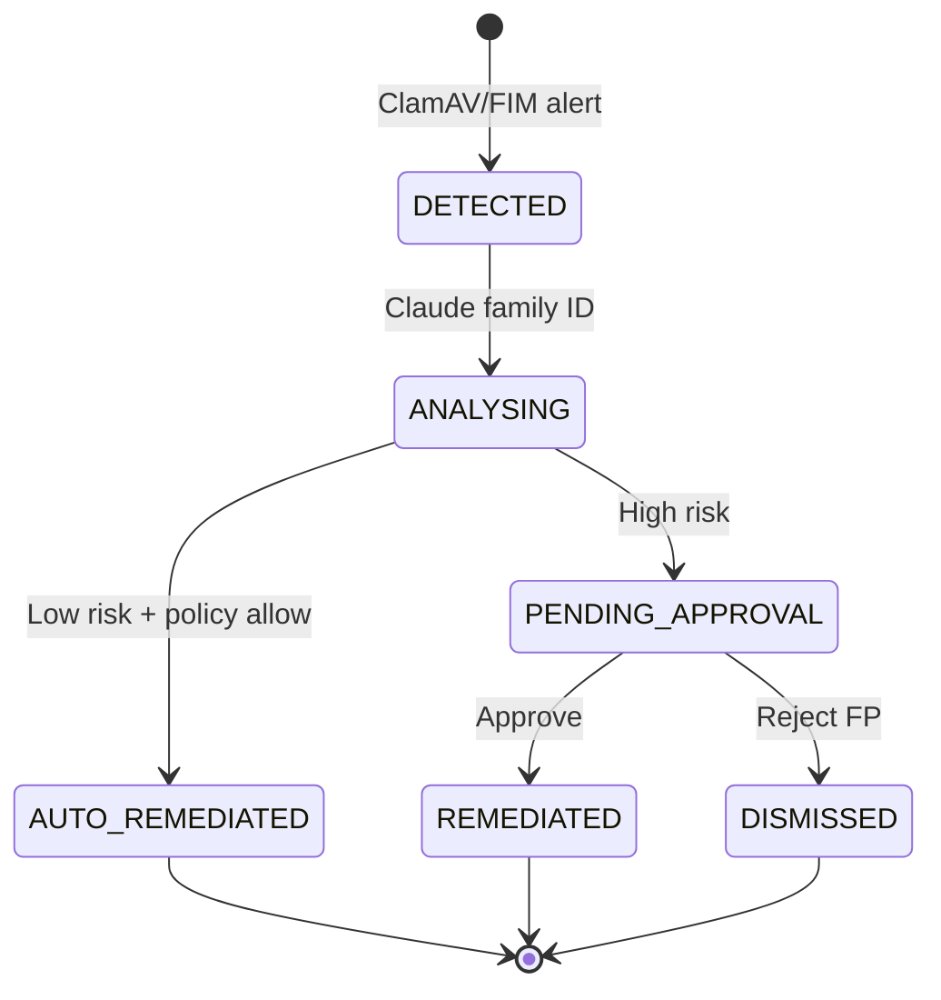
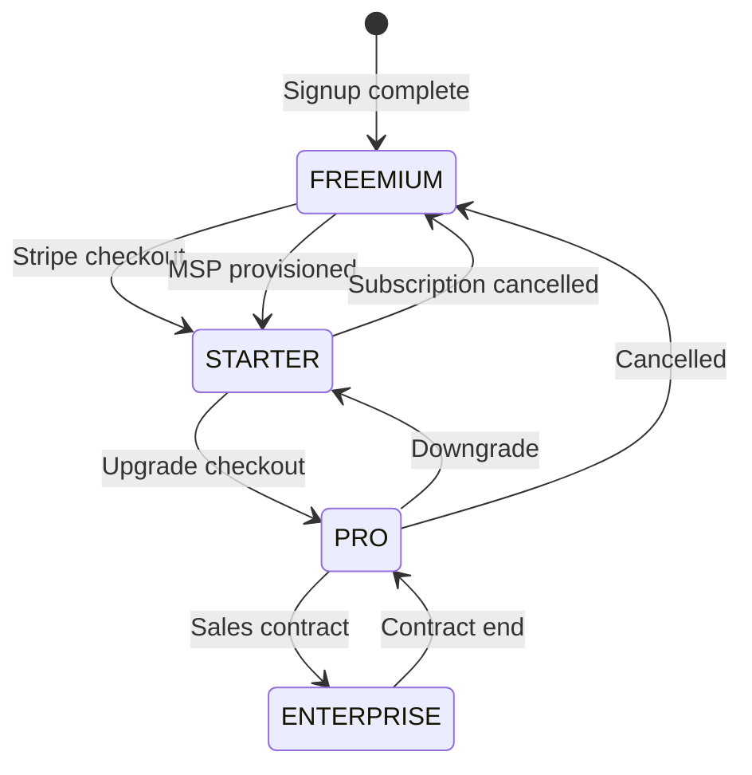
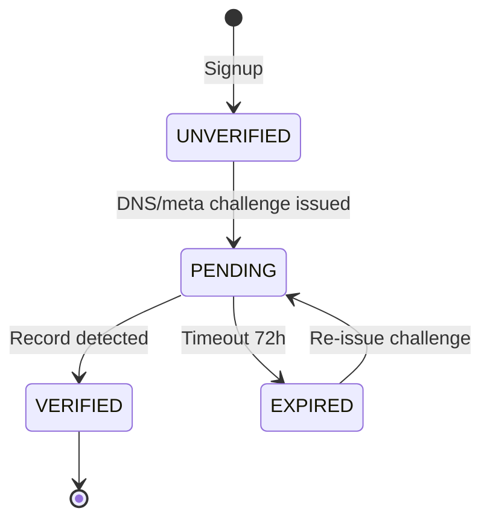
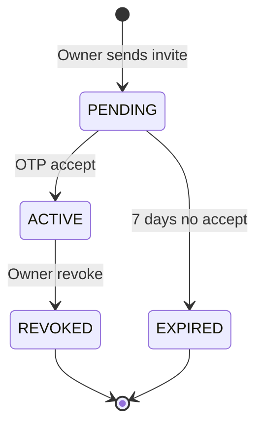
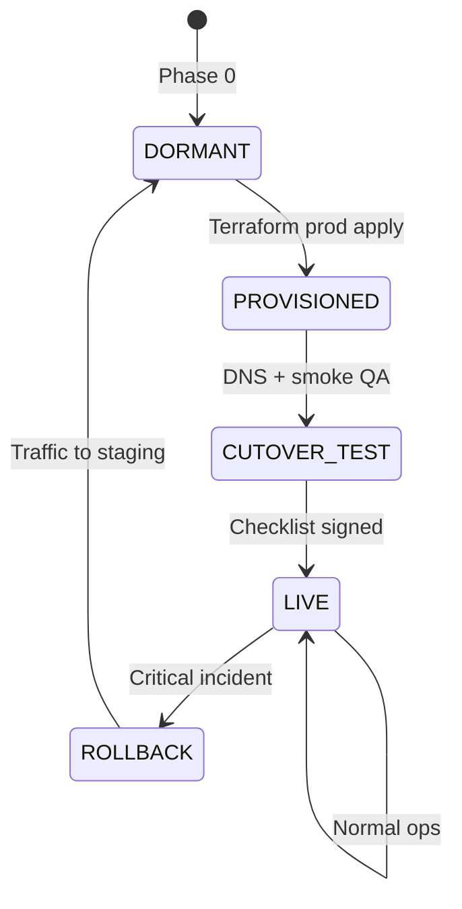
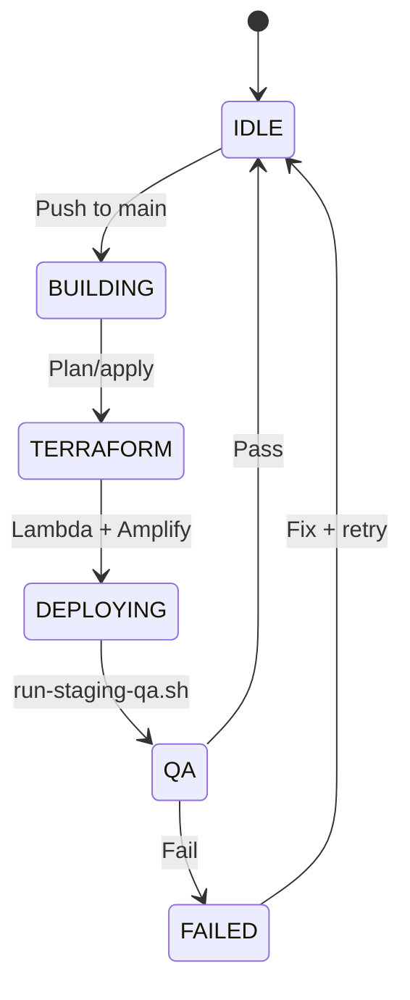

# SOCVault — State Machines
**Version 1.0 | June 2026**

Lifecycle states for scans, incidents, subscriptions, and tenant onboarding.

---

## 1. Scan lifecycle

**Store:** MongoDB `scans.status` · **FR:** FR-019, FR-031

| State | Client UX | Server behaviour |
|---|---|---|
| QUEUED | Spinner | SQS message pending |
| RUNNING | Progress % optional | Worker executing steps |
| COMPLETE | Report available | Immutable record |
| FAILED | Error message | Retry manual only |
| PARTIAL | Report + warning badge | `enrichment_status: partial` |

---

## 2. L9 AI Agent scan lifecycle

**FR:** FR-130–135 · **Wireframe:** `20-l9-ai-scan.html`

Live log: `GET /scan/l9/{scan_id}/log` streams step events from MongoDB `agent_log`.

---

## 3. SOAR incident lifecycle

**Store:** MongoDB `incidents.execution_status` · **FR:** FR-060–069

---

## 4. Malware incident lifecycle (L8)

**FR:** FR-046–054

---

## 5. Subscription / payment tier lifecycle

**Store:** MongoDB `tenants.payment_tier` · **FR:** FR-101

| Transition trigger | Side effect |
|---|---|
| → STARTER/PRO | Unlock licensed targets, layer gates |
| → FREEMIUM | Revoke paid scans; retain history read-only |
| Webhook `invoice.payment_failed` | Grace period → downgrade (Phase 2) |

---

## 6. Domain verification lifecycle

**FR:** FR-010–014

| State | Scan capability |
|---|---|
| UNVERIFIED | L1 passive recon only (FR-015) |
| VERIFIED | Paid/active layers unlocked |

---

## 7. Tenant sub-user lifecycle

**FR:** FR-140–144 · **Store:** MongoDB `sub_users.status`

---

## 8. Production environment lifecycle (platform)

**ADR-006**

---

## 9. CI/CD deployment state (staging)

---

## Related documents

| Doc | Role |
|---|---|
| [`02_SYSTEM_FLOWS.md`](./02_SYSTEM_FLOWS.md) | Transition triggers in sequences |
| [`21_MVP_FUNCTIONAL_SPEC.md`](../21_MVP_FUNCTIONAL_SPEC.md) | Business rules per state |
| [`03_DATA_FLOW_EXTENDED.md`](./03_DATA_FLOW_EXTENDED.md) | Store updates on transition |
